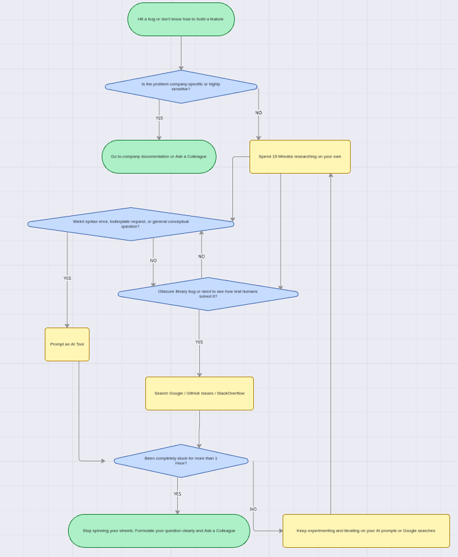

# help_strategy.md

## 10.1 When you get stuck - what next?

### When do you prefer using AI vs. searching Google?

**I prefer AI when:**
* I need an explanation for an obscure error message or stack trace.
* I need to generate repetitive boilerplate code.
* I need a concept explained to me like I'm a beginner.

**I prefer Google when:**
* I am dealing with a highly specific bug in a niche library, where reading GitHub Issues from other developers is more reliable.
* I need the most up-to-date documentation for a tool that just released a new version (since AI knowledge cut-offs can cause hallucinations).
* I am looking for broad architectural opinions (e.g., reading tech blogs on system design).

### How do you decide when to ask a colleague instead?

I follow the **"15-Minute / 1-Hour Rule."** First, I spend 15 minutes trying to solve the problem myself using AI or Google. If I am still completely blocked after 1 hour of active debugging, I ask a colleague. I also immediately ask a colleague if the problem involves proprietary business logic (e.g., "How does Focus Bear calculate this specific habit streak?") or if fixing it requires touching highly sensitive production data that shouldn't be shared with external AI tools.

### What challenges do developers face when troubleshooting alone?

1. **The "Tunnel Vision" Trap:** Spending three hours fixing a complex configuration error, only to realize later you were editing the wrong file entirely.
2. **AI Hallucinations:** Blindly trusting AI-generated code without understanding it, leading to subtle bugs or security vulnerabilities down the line.
3. **Burnout and Frustration:** Staring at a screen in isolation can drain motivation. Sometimes, just articulating the problem out loud to a senior developer instantly triggers the solution in your own mind.

### Flowchart

