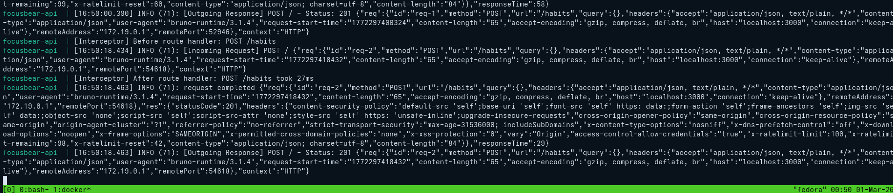

# nestjs-api-debugging.md

## 10.4 Inspecting API Requests & Responses

### How can logging request payloads help with debugging?

Logging payloads eliminates the guessing game between the frontend and the backend. If a frontend developer says, "The habit creation is broken," looking at the request payload logs immediately tells you if the frontend sent the wrong data structure (e.g., sending `title` instead of `name`), or if the backend received the correct data but failed to process it. It isolates the exact point of failure.

### What tools can you use to inspect API requests and responses?

* **Bruno / Postman / Insomnia:** GUI-based API clients that allow you to construct, save, and inspect full HTTP lifecycles.
* **cURL:** A command-line tool for making quick, raw HTTP requests.
* **Browser DevTools (Network Tab):** Essential for inspecting how a live web application is formulating its requests and handling the server's responses.
* **VS Code Debugger:** Freezing the code inside the controller to inspect the `request` object in real-time.

### How would you debug an issue where an API returns the wrong status code?

1. **Reproduce the Request:** Fire the exact same request using Bruno to see the raw response and headers.
2. **Trace the Logic:** Place a breakpoint in the Controller method to ensure it is being hit. 
3. **Check Exception Filters:** In NestJS, if a service throws a generic `Error`, NestJS defaults to returning a `500 Internal Server Error`. I would step through the code to see if an error is being swallowed or if I need to throw a specific `HttpException` (like `NotFoundException` or `BadRequestException`) instead.
4. **Inspect Validation:** Check if a validation pipe (DTO) is automatically rejecting the request with a `400 Bad Request` before it even reaches my controller logic.

### What are some security concerns when logging request data?

Logging is a massive security risk if not handled correctly. Logs are often exported to third-party monitoring services (like Datadog, Splunk, or AWS CloudWatch). If you log raw request payloads, you might accidentally store **Plaintext Passwords, API Keys, Authorization Tokens (JWTs), or Personally Identifiable Information (PII)** like credit card numbers or medical data. Developers must explicitly sanitize and redact sensitive fields before writing payloads to the console or log files.

### Working API Response From Bruno Using Debugger

