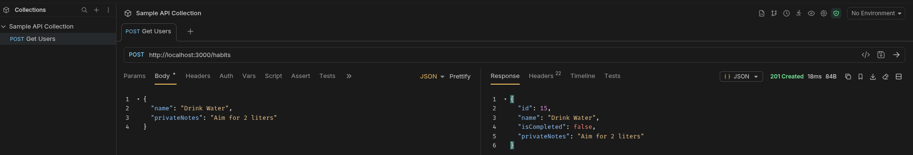

# nestjs-bruno.md

## 10.2 API Debugging with Bruno

### How does Bruno help with API testing compared to Postman or cURL?

* **vs. Postman:** Bruno is lightweight, open-source, and offline-first. Instead of saving your API collections in a proprietary cloud (like Postman), Bruno saves them as plain text `.bru` files directly in a folder on your machine. This makes Bruno incredibly Git-friendly; developers can review API changes in pull requests.
* **vs. cURL:** While cURL is great for quick terminal commands, it becomes a nightmare to type out long, nested JSON payloads or manage expiring authentication tokens. Bruno provides a clean GUI to save, organize, and tweak these complex requests effortlessly.

### How do you send an authenticated request in Bruno?

You can handle authentication at the individual request level or the collection level. 
1. Click on the **Auth** tab under your request (or collection settings).
2. Select **Bearer Token** from the dropdown menu.
3. Paste your generated Auth0 JSON Web Token (JWT) into the token field. 
4. Bruno will automatically inject the `Authorization: Bearer <token>` header into your HTTP request when you hit send.

### What are the advantages of organizing API requests in collections?

Collections act as living, executable documentation for your backend. By organizing requests into collections, you can:
* Share the exact API structure with frontend developers or new team members by simply committing the folder to Git.
* Utilize **Environment Variables**. Instead of typing `http://localhost:3000` on 50 different requests, you can create a `{{base_url}}` variable and easily swap between your Local, Staging, and Production environments with one click.

### How would you structure a Bruno collection for a NestJS backend project?

I would structure the Bruno collection to mirror the modular architecture of the NestJS application:
1. **Root Collection:** `Focus Bear API`
2. **Environments:** Setup `Local` (`base_url = http://localhost:3000`) and `Production`.
3. **Folders (Modules):** * `📁 /Habits`
     * `🟢 GET /habits` (Fetch all)
     * `🟡 POST /habits` (Create new)
     * `🔴 DELETE /habits/:id` (Remove)
   * `📁 /Users`
   * `📁 /System` (e.g., the `/test-db` health check)
   
### Bruno Sample Output

