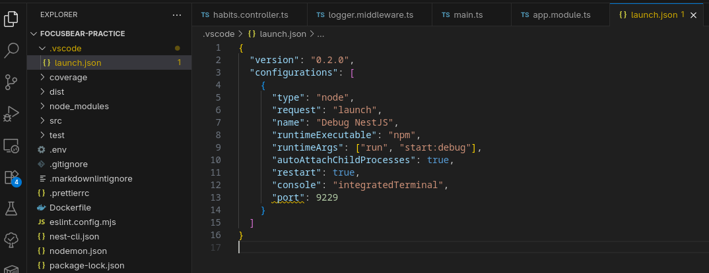

# nestjs-debugging-vscode.md

## 10.3 Debugging with VS Code & Breakpoints

### How do breakpoints help in debugging compared to console logs?

* **Zero Code Modification:** You don't have to litter your codebase with `console.log()` statements and remember to delete them before pushing to GitHub.
* **Deep Inspection:** A console log only prints exactly what you tell it to. A breakpoint freezes execution and lets you explore the *entire* state of the application—you can view all local variables, the exact call stack (how the code got there), and the global execution context.
* **Real-Time Stepping:** Breakpoints allow you to step through your logic line-by-line, watching how variables change and evaluating boolean logic in real-time.

### What is the purpose of `launch.json`, and how does it configure debugging?

The `launch.json` file lives in the `.vscode` folder and acts as an instruction manual for the IDE. It tells VS Code exactly how to start your NestJS application (e.g., running `npm run start:debug`), which port to attach the Node.js debugger to (usually `9229`), and how to map the compiled JavaScript code back to your original TypeScript files using source maps.

### How can you inspect request parameters and responses while debugging?

Once a breakpoint pauses execution inside a Controller or Service, you can inspect parameters in a few ways:
1. **Hovering:** Simply hover your mouse cursor over the variable (like a DTO object or `request.user`) in the editor to see a popup of its current data.
2. **Variables Panel:** Look at the "Variables" pane in the VS Code debug sidebar to explore nested objects, arrays, and scopes.
3. **Debug Console:** Type JavaScript expressions directly into the Debug Console to evaluate data on the fly (e.g., typing `dto.name.toUpperCase()`).

### How can you debug background jobs that don’t run in a typical request-response cycle?

Background jobs (like those handled by BullMQ or cron jobs) run asynchronously, but they still run inside the Node.js process. As long as the VS Code debugger is attached to the NestJS runtime, you can simply place a breakpoint inside the worker's `process()` method. When the queue picks up a job in the background, VS Code will automatically snap to the foreground and pause execution exactly like an HTTP request.

### .vscode > launch.json

