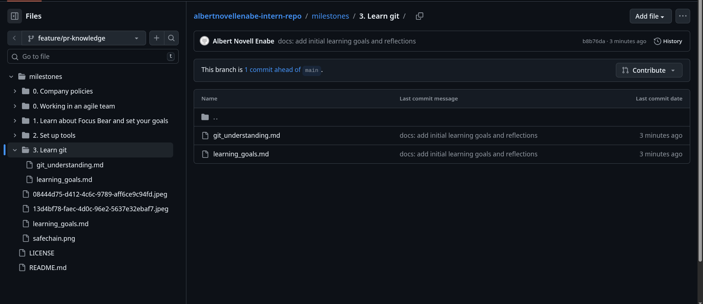

# Git Understanding: Pull Requests (PRs)

### 1. Why are PRs important in a team workflow?
Pull Requests act as a "quality gate" for software projects. They allow team members to review changes, run automated tests, and discuss implementation details before code is merged into the stable `main` branch. This process facilitates knowledge sharing, catches bugs early, and ensures that the codebase maintains a high standard of quality.

### 2. What makes a well-structured PR?
A high-quality PR should include:
- **Clear Title & Description:** Explaining "the why" behind the change, not just "the what."
- **Small, Atomic Changes:** Focused on a single task to make reviewing easier.
- **Related Issue Links:** Using keywords like `Closes #123` to automate the workflow.
- **Evidence of Testing:** Screenshots or logs showing that the code works as expected.

### 3. What did you learn from reviewing an open-source PR?
While reviewing public repositories (like React or VS Code), I observed that maintainers prioritize clarity and consistency. The most effective reviewers use constructive language, often framing suggestions as questions rather than demands. I also noticed that automated CI/CD checks (like linting and unit tests) are the first line of defense, allowing human reviewers to focus on the high-level logic and architecture.

