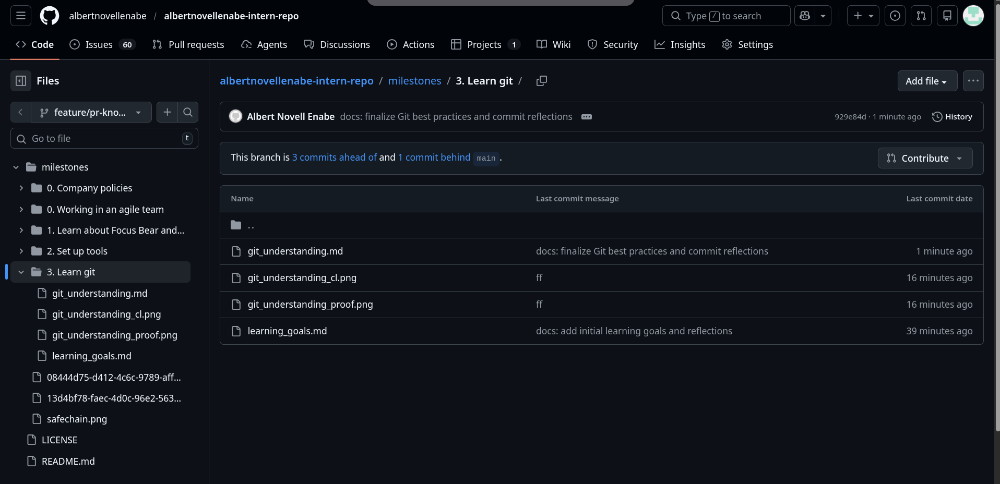
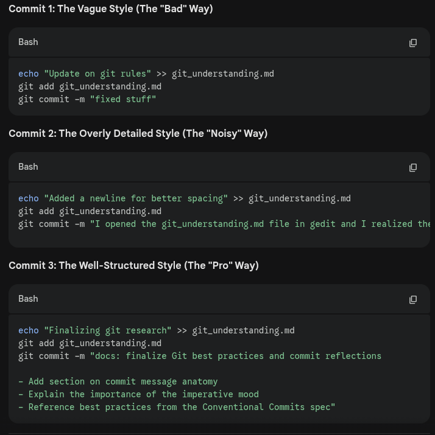
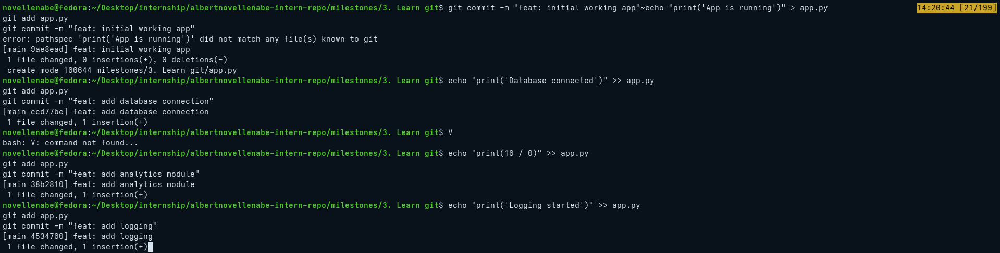
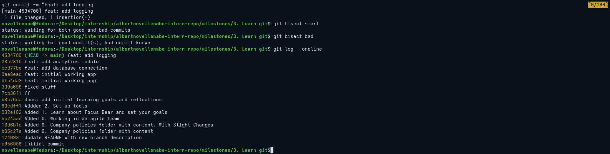
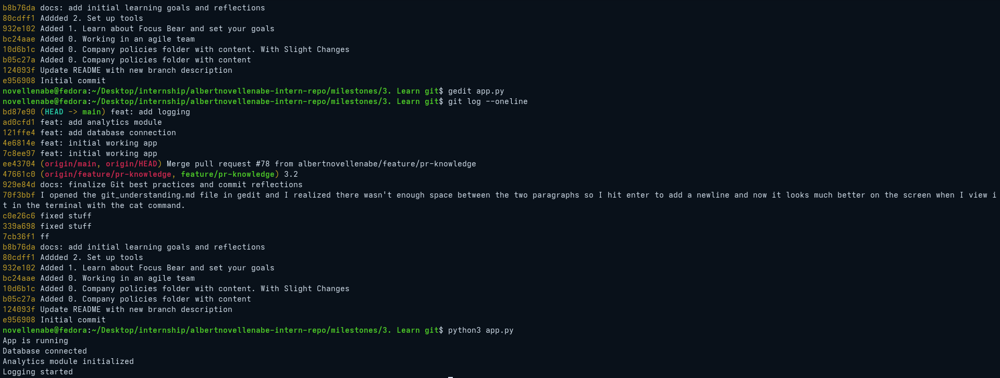
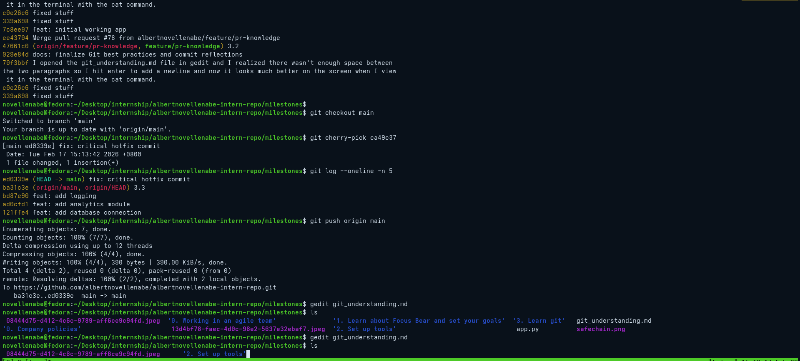
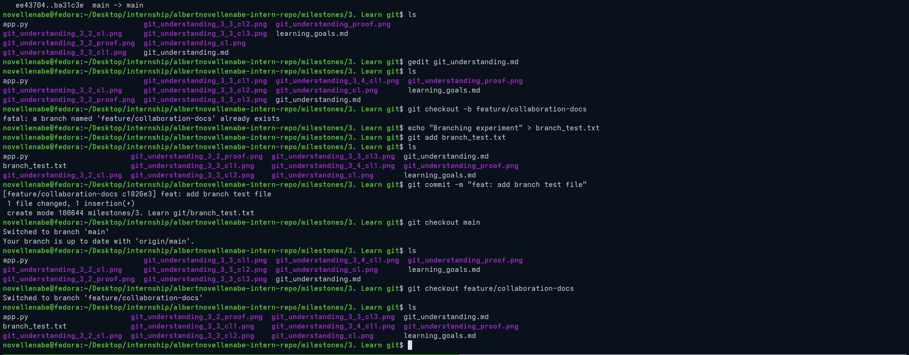
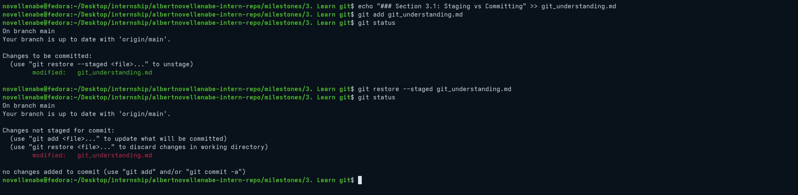
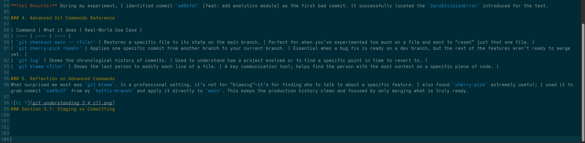

# Clean Code Reflections

## 3.1 Pull Requests

### 1. Why are PRs important in a team workflow?

Pull Requests act as a "quality gate" for software projects. They allow team members to review changes, run automated tests, and discuss implementation details before code is merged into the stable `main` branch. This process facilitates knowledge sharing, catches bugs early, and ensures that the codebase maintains a high standard of quality.

### 2. What makes a well-structured PR?

A high-quality PR should include:

- **Clear Title & Description:** Explaining "the why" behind the change, not just "the what."
- **Small, Atomic Changes:** Focused on a single task to make reviewing easier.
- **Related Issue Links:** Using keywords like `Closes #123` to automate the workflow.
- **Evidence of Testing:** Screenshots or logs showing that the code works as expected.

### 3. What did you learn from reviewing an open-source PR?

While reviewing public repositories (like React or VS Code), I observed that maintainers prioritize clarity and consistency. The most effective reviewers use constructive language, often framing suggestions as questions rather than demands. I also noticed that automated CI/CD checks (like linting and unit tests) are the first line of defense, allowing human reviewers to focus on the high-level logic and architecture.

## 3.2 Writing Meaningful Commit Messages

### 1. What makes a good commit message?

A good commit message follows the **50/72 rule**: a concise subject line (under 50 characters) and a detailed body (wrapped at 72 characters) if necessary. It uses the **imperative mood** (e.g., "Fix bug" instead of "Fixed bug"), which treats the commit like a command that will be applied to the codebase. Using a prefix like `feat:`, `fix:`, or `docs:#` (Conventional Commits) also helps categorize the history.

### 2. How does a clear commit message help in team collaboration?

Clear messages serve as a "logbook" for the team. When a developer runs `git blame` to see why a specific line of code exists, a clear message explains the *intent* behind the change. It reduces the need for meetings and allows reviewers to understand the context of a Pull Request without having to ask the author for a verbal explanation.

### 3. How can poor commit messages cause issues later?

Poor messages like "save" or "fixed" create a "dark" history. If a bug is discovered six months later, it becomes nearly impossible to use `git bisect` or `git log` to find when or why the error was introduced. It forces developers to waste time reading through every line of a diff to reverse-engineer the thought process of the original author.
Update on git rules
Added a newline for better spacing
Finalizing git research

## 3.3 Understand git bisect

### 1. The Importance of Pull Requests (PRs)

Pull Requests act as a "quality gate" for software projects. They allow team members to review changes, run automated tests, and discuss implementation details before code is merged into the stable `main` branch. This process facilitates knowledge sharing, catches bugs early, and ensures that the codebase maintains a high standard of quality.

### 2. Commit Message Best Practices

A good commit message follows the **50/72 rule**: a concise subject line (under 50 characters) and a detailed body (wrapped at 72 characters) if necessary. It should use the **imperative mood** (e.g., "Fix bug" instead of "Fixed bug").

- **How it helps collaboration:** Clear messages serve as a logbook, explaining the *intent* behind a change so future developers don't have to guess.
- **Risks of poor messages:** Vague messages like "fixed stuff" create a "dark" history, making it nearly impossible to troubleshoot or reverse-engineer logic months later.

### 3. Debugging with Git Bisect

`git bisect` is a powerful debugging tool that uses a binary search to find the exact commit that introduced a bug. By marking one commit as 'good' and another as 'bad', Git splits the history in half repeatedly, asking the developer to test each step until the culprit is found.

- **Real-world use:** I would use this when a regression occurs in a large project. If a feature that worked yesterday is broken today after 20 new commits, `git bisect` finds the error in ~5 steps.
- **Manual vs. Bisect:** Manual review is slow and subjective. `git bisect` is fast, mathematical, and highly efficient for complex bugs where the cause isn't immediately obvious.

### 4. Git Bisect Test Results

During my test scenario, I identified the commit `ad0cfd1` (feat: add analytics module) as the first bad commit. The process successfully located the `ZeroDivisionError` I introduced for testing. After identifying the culprit, I used `git bisect reset` and applied a fix to restore the stability of the `main` branch.

## 3.4 Advanced Git Commands & When to Use Them

### 1. The Importance of Pull Requests (PRs) 3.4

Pull Requests (PRs) act as a "quality gate" for software projects. They allow team members to review changes, run automated tests, and discuss implementation details before code is merged into the stable `main` branch. This process facilitates knowledge sharing, catches bugs early, and ensures that the codebase maintains a high standard of quality.

### 2. Commit Message Best Practices 3.4

A good commit message follows the **50/72 rule**: a concise subject line (under 50 characters) and a detailed body (wrapped at 72 characters) if necessary. It should use the **imperative mood** (e.g., "Fix bug" instead of "Fixed bug").

- **How it helps collaboration:** Clear messages serve as a logbook, explaining the *intent* behind a change so future developers don't have to guess.
- **Risks of poor messages:** Vague messages like "fixed stuff" or "save" create a "dark" history, making it nearly impossible to troubleshoot or reverse-engineer logic months later.

### 3. Debugging with Git Bisect 3.4

`git bisect` is a powerful debugging tool that uses a binary search to find the exact commit that introduced a bug. By marking one commit as 'good' and another as 'bad', Git splits the history in half repeatedly until the culprit is found.

- **Real-world use:** Essential when a regression occurs in a large project. It allows a developer to find an error in ~5 steps even if there are dozens of commits to check.
- **Manual vs. Bisect:** Manual review is slow and subjective. `git bisect` is fast, mathematical, and highly efficient for complex bugs.

**Test Results:** During my experiment, I identified commit `ad0cfd1` (feat: add analytics module) as the first bad commit. It successfully located the `ZeroDivisionError` introduced for the test.

### 4. Advanced Git Commands Reference

| Command | What it does | Real-World Use Case |
| :--- | :--- | :--- |
| `git checkout main -- <file>` | Restores a specific file to its state on the main branch. | Perfect for when you've experimented too much on a file and want to "reset" just that one file. |
| `git cherry-pick <hash>` | Applies one specific commit from another branch to your current branch. | Essential when a bug fix is ready on a dev branch, but the rest of the features aren't ready to merge yet. |
| `git log` | Shows the chronological history of commits. | Used to understand how a project evolved or to find a specific point in time to revert to. |
| `git blame <file>` | Shows the last person to modify each line of a file. | A key communication tool; helps find the person with the most context on a specific piece of code. |

### 5. Reflection on Advanced Commands

What surprised me most was `git blame`. In a professional setting, it’s not for "blaming"—it’s for finding who to talk to about a specific feature. I also found `cherry-pick` extremely useful; I used it to grab commit `ca49c37` from my `hotfix-branch` and apply it directly to `main`. This keeps the production history clean and focused by only merging what is truly ready.

## 3.5 Branching & Team Collaboration

### Why is pushing directly to main problematic?

Pushing directly to `main` is risky because it bypasses the "quality control" phase. If I introduce a syntax error or a logical bug in the database connection, I break the project for the entire team. It also makes it impossible to work on multiple features at once without the code becoming a tangled mess.

### How do branches help with reviewing code?

Branches allow for isolated development. When I submit a Pull Request from my branch, my teammates can see exactly which files I changed and leave comments on specific lines. This ensures that only high-quality, tested code is merged into the master project.

### What happens if two people edit the same file on different branches?

Git is smart enough to handle this most of the time. If we edited different parts of the file, Git will automatically combine them when we merge. However, if we both edited the exact same line, Git will trigger a **Merge Conflict**, requiring us to manually decide which version of the code should stay.

## My Workflow Habit

From now on, I will follow the "Feature Branch" workflow:

1. `git checkout -b feature/name-of-task`
2. Code, test, and commit locally.
3. Push the branch and open a Pull Request.
4. Only merge to `main` once the tests pass and a peer has approved it.

## 3.6. Git concept: staging vs committing

### 1. What is the difference between staging and committing?

- **Staging (`git add`):** This is the act of preparing your changes. It tells Git exactly which modified files you want to include in your next "snapshot." It’s like a draft or a preparation area.
- **Committing (`git commit`):** This is the act of permanently saving that snapshot to your project's history. Once committed, the changes are "recorded" and can be revisited later.

### 2. Why does Git separate these two steps?

Git separates these steps to give developers **granular control**. If you've worked on three different features in five different files, you can stage them separately and create three distinct, clean commits rather than one giant, messy one.

### 3. When would you want to stage changes without committing?

You would stage without committing when:

- You have finished one part of a task but aren't ready to save the whole project yet.
- You want to "group" related changes together while leaving unrelated experimental code out of the commit.
- You want to use `git diff --cached` to double-check exactly what is about to be saved before finalizing the message.

