# Clean Code Reflections

## The code samples were tested with Kotlin from my personal project

## 4.1 Understanding Clean Code Principles

### 1. Simplicity

Avoid over-engineering. Code should do one thing and do it well. If a function is too long or complex, it should be broken down into smaller, simpler parts.

### 2. Readability

Code is read much more often than it is written. Use descriptive variable names (e.g., `user_age` instead of `a`) and clear logic so that another developer can understand the intent without needing a manual.

### 3. Maintainability

Code should be structured so that future changes are easy to implement. This involves reducing "technical debt" by writing code that doesn't rely on brittle hacks or "magic numbers."

### 4. Consistency

Follow the project's style guide. Whether it's indentation, naming conventions, or folder structure, consistency reduces the mental load on developers moving between different parts of the codebase.

### 5. Efficiency

Write code that performs well, but avoid "premature optimization." Focus on clear algorithms and memory management, especially in resource-constrained environments like mobile apps.

### Messy Code 4.1

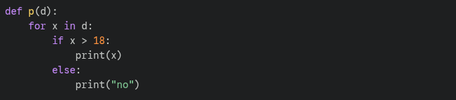

### Clean Code 4.1

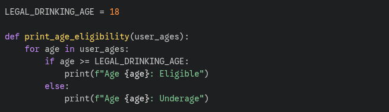

## 4.2 Naming Variables & Functions

### 1. What makes a good variable or function name?

A good name is **searchable**, **pronounceable**, and **intention-revealing**. It should tell you why it exists, what it does, and how it is used. In Kotlin, we follow `camelCase` for variables/functions and `PascalCase` for classes/Composables.

### 2. What issues can arise from poorly named variables?

- **Increased Mental Load:** Developers waste time trying to "decode" what a variable represents.
- **Hidden Bugs:** It's easy to pass the wrong data into a function if the parameters are vaguely named (e.g., passing `height` into a `width` parameter because both were just named `val d: Int`).
- **Difficult Onboarding:** New team members will struggle to contribute to the project if the codebase looks like "alphabet soup."

### 3. How did refactoring improve code readability?

Refactoring shifted the code from "How the computer sees it" to "How a human explains it." By using names like `voterAges` instead of `list`, the code becomes self-documenting, reducing the need for extra comments.

### Unclear Code 4.2

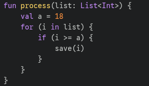

### Clean Code  4.2

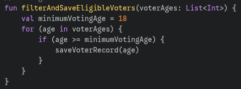

## 4.3 Writing Small, Focused Functions

### 1. Why is breaking down functions beneficial?

- **Easier Testing:** I can write a unit test specifically for `calculateTotal` without needing to trigger a payment or an email.
- **Reusability:** The `sendConfirmationEmail` function can now be used by other parts of the app without duplicating code.
- **Improved Debugging:** If the payment fails, I know exactly which small function to look at, rather than digging through a 50-line `checkout` block.

### 2. How did refactoring improve the structure of the code?

Refactoring made the top-level `checkout` function look like a **summary** or a "Table of Contents." You can read it and immediately understand the high-level logic without getting distracted by the mathematical details of how a coupon is calculated. It separates "what" the code is doing from "how" it is doing it.

### Messy Code 4.3

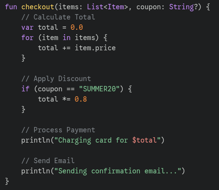

### Refactored Code 4.3

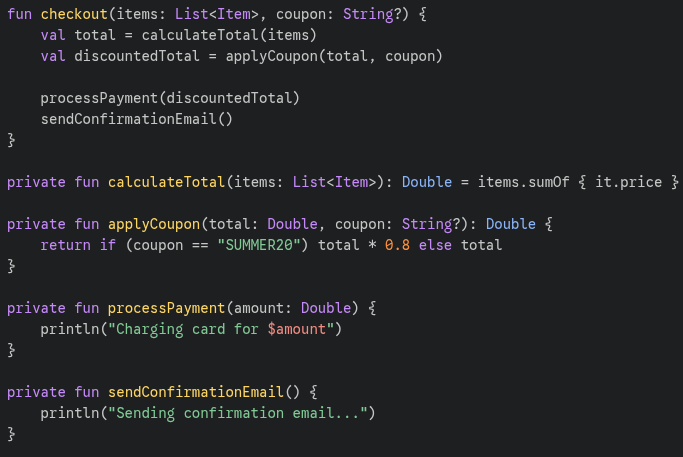

## 4.4 Avoiding Code Duplication

### 1. What were the issues with duplicated code?

The biggest issue was **fragility**. If I decided to change the currency symbol from `$` to `₱` (Pesos), I would have to manually search through every file in the project to find where I hardcoded the dollar sign. If I missed one, the app would show inconsistent data, which looks unprofessional.

### 2. How did refactoring improve maintainability?

Refactoring improved maintainability by creating a **Single Source of Truth**. Now, if the business logic for formatting currency changes, I only have to edit one function in one file. The change automatically updates the entire application, reducing the risk of bugs and making the code much easier to update in the future.

### Duplicated Code 4.4

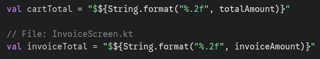

### Refactored Code 4.4

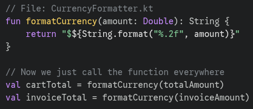

## 4.5 Commenting & Documentation

### 1. When should you add comments?

- **Intent:** When the code's purpose isn't immediately obvious from the function name.
- **Warnings:** To warn other developers about consequences (e.g., "Deleting this will break the Firebase integration").
- **External References:** Linking to a StackOverflow answer or a GitHub issue that explains a specific workaround.

### 2. When should you avoid comments and instead improve the code?

- **Redundancy:** If the comment simply repeats the code.
- **Obscure Naming:** If you need a comment to explain what a variable is, rename the variable (e.g., use `isPaymentComplete` instead of `val p = true // payment done`).
- **Large Functions:** Instead of using comments to mark "Section A" and "Section B," extract those sections into their own named functions.

### Poor Commenting 4.5

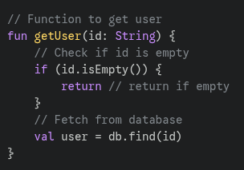

### Useful Documentation 4.5

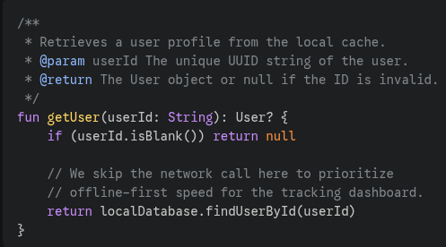

## 4.6 Handling Errors & Edge Cases

### 1. What was the issue with the original code?

The original code suffered from the **"Arrow Anti-pattern,"** where nested `if` statements made the main logic hard to find. It also failed silently in some cases (printing to console instead of handling the error), which could lead to "ghost bugs" where data isn't saved, but the developer doesn't know why.

### 2. How does handling errors improve reliability?

- **Predictability:** By validating inputs at the start, the function guarantees that any code following the Guard Clauses is working with "clean" data.
- **Better UX:** Instead of the app crashing, we can catch specific errors and show helpful messages to the user.
- **Easier Debugging:** Using explicit exceptions (like `IllegalArgumentException`) tells the developer exactly what went wrong and where, rather than forcing them to trace through multiple nested blocks.

### Unsafe Code 4.5

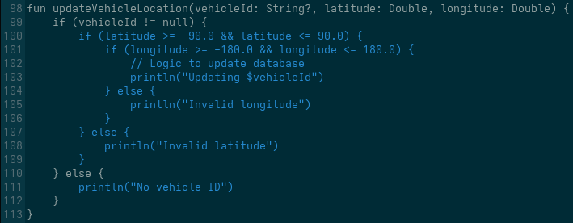

### Refactored and Robust 4.5

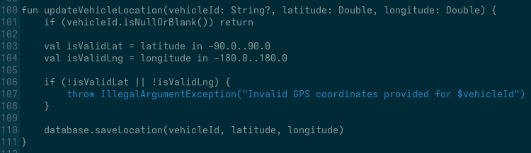

## 4.7 Refactoring Code for Simplicity

### 1. What made the original code complex?

The original code suffered from **Deep Nesting**. To understand the "20% discount" logic, a developer had to track three different `if` conditions in their head simultaneously. It also used a mutable variable (`var discount`) which can lead to bugs if the logic grows more complex.

### 2. How did refactoring improve it?

Refactoring improved the code by **reducing cognitive load**. By using Guard Clauses, we handled the "Logged Out" state immediately and cleared it from our minds. Using a `when` expression allowed us to see all possible outcomes in a flat, table-like structure, making it much easier to verify that the logic is correct.

### Too Complicated Code 4.7

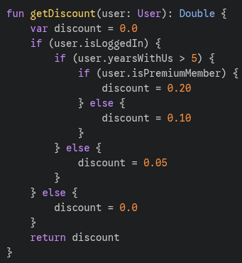

### Simplified Version 4.7

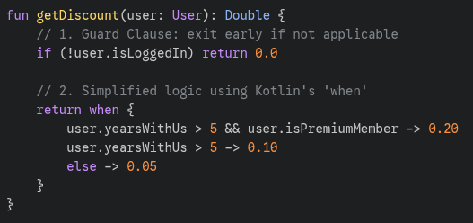

## 4.9 Writing Unit Tests for Clean Code

### 1. How do unit tests help keep code clean?

Unit tests act as a "Clean Code Enforcer." To make a function testable, it **must** be small, focused, and free of hidden side effects (like reaching out to a real database). If I find a function impossible to test, it’s a "Code Smell" telling me I need to break it down into smaller, simpler pieces.

### 2. What issues did you find while testing?

While writing tests, I realized that "Edge Cases" are easy to overlook. For example, I initially didn't think about what happens if a user inputs a negative number. Writing the test forced me to add a **Guard Clause** to handle that unexpected input, making the function more robust.

### Function Code 4.9

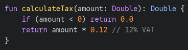

### Unit Test 4.9

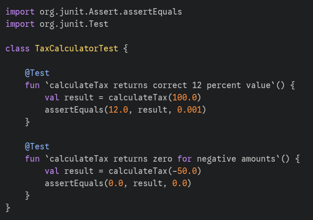

## 4.10 Code Formatting & Style Guides

### 1. Why is code formatting important?

Code formatting is important because it creates **consistency**. In a professional team, having a shared style guide (like Airbnb's) prevents "style wars" and ensures that version control diffs are clean. It allows developers to focus on solving problems rather than arguing about where a bracket should go.

### 2. What issues did the linter detect?

When I ran ESLint, it detected several issues:

- **Unused Variables:** Variables that were declared but never used (Code Smell!).
- **Missing Semicolons:** Inconsistent line endings.
- **Single vs Double Quotes:** Mixing different string formats.
- **Trailing Commas:** Missing commas at the end of objects, which makes Git diffs messier.

### 3. Did formatting the code make it easier to read?

Yes, significantly. Prettier standardized the indentation and line length across all my Express.js files. The code now looks much more organized, and it’s easier to spot logic errors because the visual "clutter" of inconsistent spacing has been removed.

### Prettier 4.10

