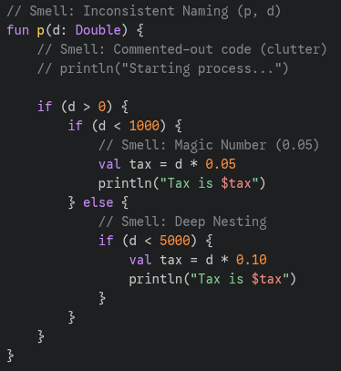
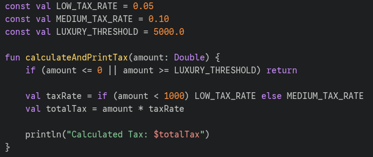

#### The code samples were tested with Kotlin from my personal project

# 4.8 Identifying & Fixing Code Smells

### 1. What code smells did you find in your code?
- **Magic Numbers:** Hardcoded tax rates (0.05, 0.10) that had no context.
- **Deep Nesting:** Multiple `if` statements making the logic look like an arrow.
- **Inconsistent Naming:** Using `p` for a function name instead of a descriptive verb.
- **Commented-Out Code:** Leftover print statements that serve no purpose but distract the reader.

### 2. How did refactoring improve readability and maintainability?
Refactoring made the **intent** of the code clear. By using constants like `LOW_TAX_RATE`, anyone reading the code knows exactly what those numbers mean. Using Guard Clauses flattened the logic, so I no longer have to keep track of three nested conditions at once.

### 3. How can avoiding code smells make future debugging easier?
When code smells are removed, the "noise" is gone. If there is a bug in the tax calculation, I can find the logic instantly because it's in a small, well-named function. In smelly code, bugs hide in the complexity; in clean code, there is nowhere for them to hide.

### Smelly Commenting

### Refactored Code

