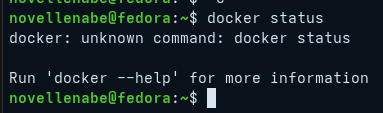
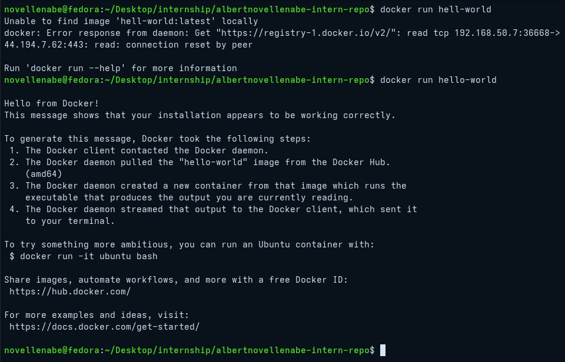
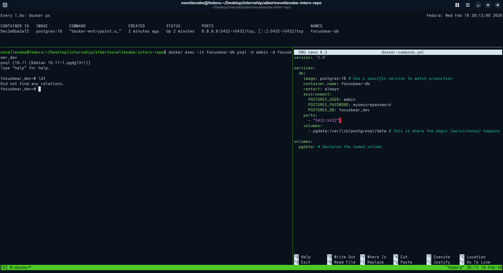
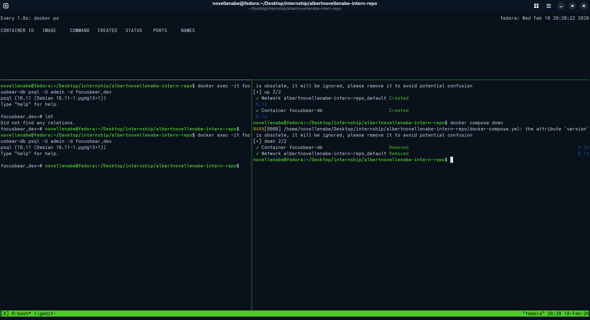

# docker-intro.md

## 5.1 Introduction to Docker

### 1. How does Docker differ from a virtual machine?

Virtual Machines include a full guest operating system, making them slow and resource-heavy. Docker containers share the host's system kernel, making them much faster to start and significantly smaller in size.

### 2. Why is containerization useful for a backend like Focus Bear’s?

It ensures that every developer is working in an identical environment. It also allows Focus Bear to scale services easily; if the backend is under heavy load, we can simply spin up more identical containers.

### 3. How do containers help with dependency management?

Containers package the specific version of every library, tool, and runtime the app needs. This prevents "version hell"—where updating a tool for one project breaks another project on the same computer.

### 4. What are the potential downsides of using Docker?

- **Learning Curve:** Managing networks and volumes between containers can be complex initially.
- **Performance Overhead:** While minimal on Linux, Docker on macOS/Windows requires a lightweight VM, which can consume significant RAM.
- **Storage:** Unused images and containers can quickly fill up your disk if not cleaned regularly.

### Docker successfully installed

## 5.2 Docker Setup & Managem

### 1. What is the difference between `docker run` and `docker-compose up`?

`docker run` is used to start a **single** container. You have to manually specify all ports, volumes, and networks in the command. `docker-compose up` reads a `docker-compose.yml` file to start and link **multiple** containers (like a database and an API) with one command.

### 2. How does Docker Compose help when working with multiple services?

It acts as an orchestrator. It ensures that the database starts before the API, puts them on the same internal network so they can "talk" to each other, and manages environment variables for all services in one central place.

### 3. What commands can you use to check logs from a running container?

I use `docker logs <container_id>`. Adding the `-f` (follow) flag is the most useful way to debug, as it streams the logs in real-time as events happen in the backend.

### 4. What happens when you restart a container? Does data persist?

When a container is restarted, the processes inside it start over, but the state of the "writable layer" remains. However, if the container is **deleted**, all data inside is lost **unless** you use **Volumes**. Focus Bear uses volumes to map a folder on my Fedora machine to the database folder inside the container so the data survives even if the container is destroyed.

### Docker setup successfully working

## 5.3 Running PostgreSQL in Docker

### 1. What are the benefits of running PostgreSQL in a Docker container?

Running Postgres in Docker avoids "polluting" my Fedora system with local database installations. It allows me to spin up a pre-configured database with specific users and passwords in seconds, ensuring that every developer on the Focus Bear team has the exact same setup.

### 2. How do Docker volumes help persist PostgreSQL data?

Containers are ephemeral by nature—if they are deleted, the data inside them dies. Volumes map a persistent storage area on my Fedora host to the database directory inside the container (`/var/lib/postgresql/data`). This ensures that my data survives a `docker compose down`.

### 3. How can you connect to a running PostgreSQL container?

I can connect using the `docker exec` command to access the internal `psql` CLI, or I can use an external tool like DBeaver or pgAdmin by connecting to `localhost` on the mapped port `5432`.

### Postgres Docker Setup

## 5.4 Debugging & Managing Docker Containers

### 1. How can you check logs from a running container?

I use the command `docker logs <container_id>`. To troubleshoot live issues, the `-f` (follow) flag is essential because it streams new log entries as they are generated by the backend service.

### 2. What is the difference between `docker exec` and `docker attach`?

- **`docker exec`**: Creates a **new** process inside the container. This is the safest way to open a shell (`sh` or `bash`) without disturbing the main application.
- **`docker attach`**: Connects your terminal to the **main** process (PID 1) of the container. If you stop the process with `Ctrl+C` while attached, the entire container usually stops.

### 3. How do you restart a container without losing data?

To restart, I use `docker stop` followed by `docker start`, or simply `docker restart`. Because I have configured **Volumes**, the data lives on my Fedora host. Even if I use `docker-compose down` (which removes the container) and then `up`, the data persists because the volume is reattached to the new container.

### 4. How can you troubleshoot database connection issues inside a containerized NestJS app?

I first check the logs of the NestJS container to see the specific error message. Then, I use `docker exec` to enter the NestJS container and try to "ping" the database container using its service name. Finally, I verify that the environment variables (DB_HOST, DB_PORT) in the `.env` file match the configuration in `docker-compose.yml`.

