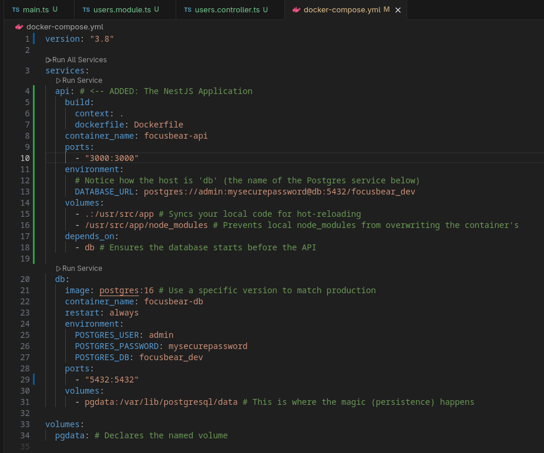

# docker-nestjs.md

## 6.6 Using Docker for NestJS Development

### How does a `Dockerfile` define a containerized NestJS application?

A `Dockerfile` acts as a step-by-step blueprint for building a standalone, executable image of your application. It specifies the base operating system and runtime (e.g., `node:20-alpine`), defines the working directory, copies the necessary application files (`package.json`, source code), runs the installation commands (`npm ci`), and dictates the exact command required to boot the NestJS server. This guarantees the application will behave exactly the same way regardless of the host machine running it.

### What is the purpose of a multi-stage build in Docker?

Multi-stage builds are used to drastically reduce the final size of a Docker image and improve security.
**Stage 1 (Builder):** Installs all dependencies (including heavy `devDependencies` like the TypeScript compiler) and builds the application into plain JavaScript.
**Stage 2 (Production):** Starts with a fresh, lightweight base image, copies *only* the compiled `dist/` folder and the essential production dependencies from the first stage, and discards everything else.
This ensures development tools and source code are never exposed or shipped to production.

### How does Docker Compose simplify running multiple services together?

Docker Compose allows you to define and manage a multi-container environment using a single `docker-compose.yml` file. Just as it can orchestrate complex messaging architectures with Kafka, Zookeeper, and consumer services, it seamlessly manages the relationship between your NestJS server and PostgreSQL. By defining both services in one file, Compose automatically creates an internal bridged network, allowing your NestJS container to securely connect to the database using the service name (e.g., `postgres:5432`) as the host URL, entirely bypassing the need to manually configure IP addresses.

### How can you expose API logs and debug a running container?

**Logs:** You can natively stream the output of your containerized application using the terminal command `docker logs <container-name> -f`.

**Debugging:** To enable live step-debugging in an IDE (like VS Code), you must expose Node.js's debugging port. By starting the NestJS application with the `--debug 0.0.0.0:9229` flag and mapping that port to your host machine in the `docker-compose.yml` (`ports: ["9229:9229"]`), you can attach your IDE's debugger directly to the live container and hit breakpoints in real-time.

### Docker File

