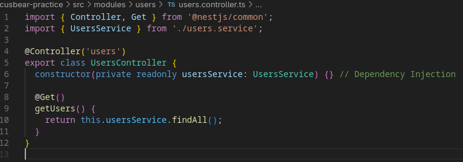
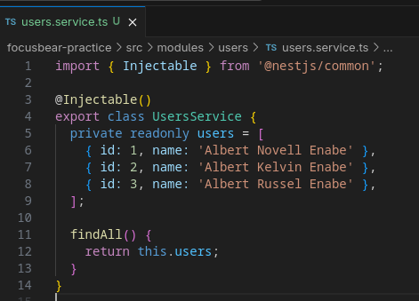

# nestjs-architecture.md

## 6.3 Understanding Modules, Controllers, and Providers in NestJS

### Core Architecture Components

### 1. Modules (`@Module()`)

Modules are the **organizational containers** of a NestJS application.

* **Purpose**: To encapsulate related logic and features into a single unit.
* **Function**: They tell Nest which controllers to instantiate and which providers are available for injection.

### 2. Controllers (`@Controller()`)

Controllers act as the **gatekeepers** or the entry points for the application.

* **Responsibility**: Handling incoming HTTP requests and returning responses to the client.
* **Routing**: They use decorators like `@Get()` or `@Post()` to map URL paths to specific methods.

### 3. Providers/Services (`@Injectable()`)

Providers are the **logic-handlers** that perform the actual work.

* **Responsibility**: Executing business logic, such as database queries or third-party API integrations.
* **Dependency Injection**: By using the `@Injectable()` decorator, they can be "injected" into controllers.

### What is the purpose of a module in NestJS?

A module serves as a boundary and an organizer. It groups related components together, making features "pluggable" and keeping the codebase scalable by encapsulating logic.

### How does a controller differ from a provider?

A **controller** handles the transport layer (HTTP requests/responses) and maps routes. A **provider** (or service) handles the core business logic and data processing. You inject a provider into a controller so the controller remains "thin" and focused only on handling requests.

### Why is dependency injection useful in NestJS?

Dependency Injection (DI) allows for **decoupled and testable code**. Instead of manually instantiating classes, the NestJS IoC (Inversion of Control) container manages them. This makes it easy to swap real services for "mock" versions during unit testing without altering the controller logic.

### How does NestJS ensure modularity and separation of concerns?

NestJS enforces this through its **module system** where providers are private by default. To use a service in a different module, it must be explicitly **exported** from its original module and then **imported** by the module that needs it, preventing tightly coupled "spaghetti" code.

### Controller Code

### Module Code

### Service Code

