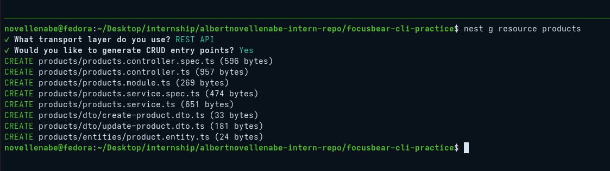

# nestjs-cli.md

## 6.5 Using NestJS CLI for Scaffolding

### How does the NestJS CLI help streamline development?

The CLI streamlines development by automating repetitive, manual tasks. It handles everything from generating boilerplate code to managing the underlying build pipeline. By using built-in commands like `nest start --watch` (for hot-reloading) and `nest build` (which wraps compilers like `tsc` or `swc`), developers can bypass complex configuration setups and focus entirely on writing business logic.

### What is the purpose of `nest generate`?

The `nest generate` (or `nest g`) command uses built-in templates (called schematics) to automatically scaffold NestJS components like modules, controllers, and services. Aside from just creating the files, its most powerful feature is that it automatically wires them up for you. For example, if you generate a service, the CLI automatically imports and registers that service inside the `providers` array of its parent module, eliminating manual import errors.

### How does using the CLI ensure consistency across the codebase?

Maintaining consistency across a large codebase with multiple developers can be difficult. The CLI solves this by enforcing NestJS's opinionated, modular architecture out of the box.
**Standardized Naming:** It automatically applies community-standard naming conventions (e.g., `user.controller.ts`, `user.service.ts`).
**Structural Integrity:** It removes "decision fatigue" by forcing developers to use the same directory structures and architectural patterns, ensuring the codebase looks uniform regardless of who wrote the feature.

### What types of files and templates does the CLI create by default?

**Project Initialization (`nest new`):** It generates the foundational architecture, including the entry point (`main.ts`), the root module (`app.module.ts`), basic controllers/services, and essential configuration files like `nest-cli.json` and `tsconfig.json`.

**Component Scaffolding (`nest generate`):** When generating a specific component, it defaults to creating the primary TypeScript class file and an accompanying `.spec.ts` file formatted for unit testing with Jest.

**Full Resources (`nest g resource`):** It generates a complete CRUD boilerplate including a Module, Controller, Service, Data Transfer Objects (DTOs), and Entities.

### CLI

