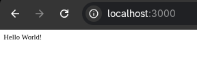
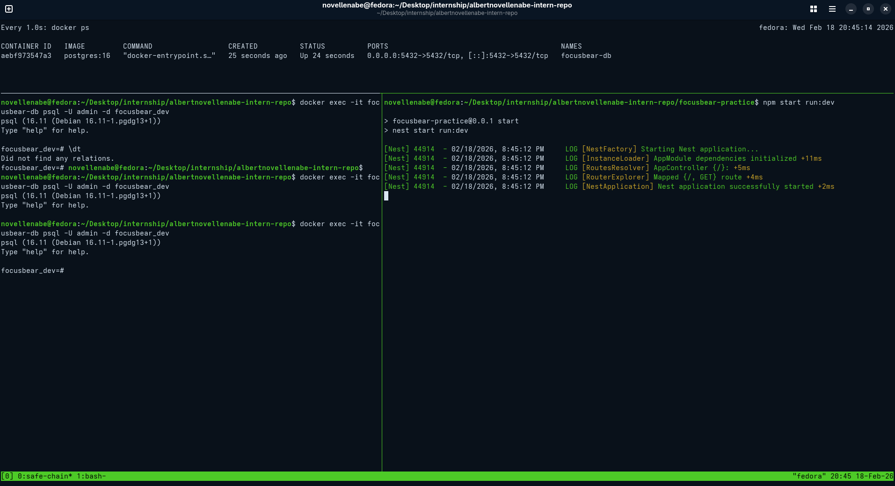

# nestjs-setup.md

## 6.2 Setting Up a NestJS Project

### 1. What files are included in a default NestJS project?

A default project includes the `src/` directory containing `main.ts` (entry point), `app.module.ts` (root module), `app.controller.ts` (routes), and `app.service.ts` (logic). It also comes with configuration files like `tsconfig.json` for TypeScript and `package.json` for dependencies.

### 2. How does `main.ts` bootstrap a NestJS application?

`main.ts` acts as the engine starter. It imports the `NestFactory` and calls the `create()` method, passing in the `AppModule`. This process initializes the Dependency Injection (DI) container and starts the HTTP server (usually using Express under the hood) on a designated port.

### 3. What is the role of `AppModule` in the project?

`AppModule` is the root of the application's organizational tree. Every NestJS app must have at least one module. It serves as the "manifest" where we list all the controllers, providers, and imported modules that the application needs to function.

### 4. How does NestJS structure help with scalability?

NestJS enforces a **Modular Architecture**. Instead of one giant file, we break the app into distinct modules (e.g., `AuthModule`, `TasksModule`). This allows large teams to work on separate features without interfering with each other and makes it easy to maintain or swap out parts of the application as it grows.

### NestJs Terminal

### NestJs Web Output

