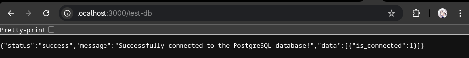
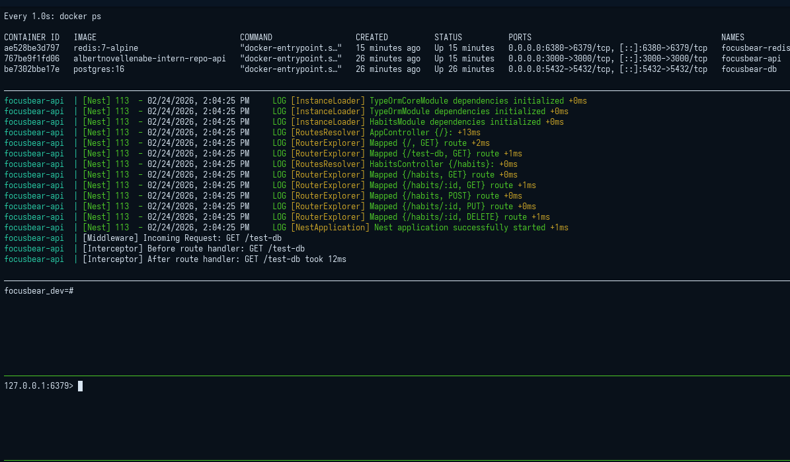

# nestjs-bullmq.md

## 7.6 Background Jobs with BullMQ & Redis in NestJS

### Why is BullMQ used instead of handling tasks directly in API requests?

Node.js runs on a single-threaded event loop. If an API request triggers a time-consuming task (like generating a PDF, processing large images, or sending a batch of emails), the server will block other incoming requests until that task finishes. By using BullMQ, the API instantly offloads the heavy task to a background queue and responds to the user immediately. This keeps the API lightning-fast and highly scalable.

### How does Redis help manage job queues in BullMQ?

Redis acts as the blazing-fast in-memory storage for these queues. If you think about how Redis handles high-throughput data streams for real-time location tracking, it applies that exact same speed and reliability to managing the precise state (waiting, active, completed, failed) of every single background job. It also uses atomic locks to guarantee that if you have multiple backend servers running, a specific job is only processed by one worker at a time, preventing duplicate executions.

### What happens if a job fails? How can failed jobs be retried?

If a worker throws an error or crashes while processing a job, BullMQ catches it. When adding a job to the queue, you can configure retry strategies (e.g., `attempts: 3`). You can also implement a "backoff" strategy (like exponential backoff), which tells BullMQ to wait an increasing amount of time before trying again. If the job exhausts all its retries, BullMQ permanently moves it to a "failed" list in Redis, where a developer can later inspect the stack trace and manually retry it if necessary.

### How does Focus Bear use BullMQ for background tasks?

Focus Bear relies on background jobs for operations that shouldn't make the mobile app wait. Examples include:
* **Push Notifications:** Sending morning habit reminders or streak alerts via Firebase/APNs.
* **Data Syncing:** Syncing local offline habit data with the central database when the user comes back online.
* **Analytics Processing:** Crunching daily or weekly productivity statistics at midnight without slowing down the primary database during peak hours.

### PostgreSQL DB Connection

### Docker Redis Container

