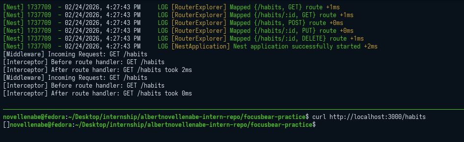

# nestjs-interceptors-middleware.md

## 7.3 Using Interceptors & Middleware in NestJS

### What is the difference between an interceptor and middleware in NestJS?

* **Middleware:** Operates exclusively at the HTTP level, running *before* the route handler. It is essentially Express.js middleware. It only knows about the raw Request and Response objects. It does not know which controller or method will eventually handle the request, and it cannot easily modify the final response data sent back from the controller.
* **Interceptors:** Operate both *before* and *after* the route handler execution. They sit much closer to the application logic. Because they have access to the `ExecutionContext`, they know exactly which class and method are being executed. Using RxJS observables, they can transform the data returned by the controller before it hits the network, handle timeouts, or completely override the response.

### When would you use an interceptor instead of middleware?

* **Use Middleware for:** Global HTTP-level operations that don't care about application context. Examples include parsing cookies, extracting JWT tokens from headers, basic request logging, rate limiting, or setting global security headers (like Helmet).
* **Use Interceptors for:** Operations tied to the application's response or execution logic. Examples include transforming the shape of the returned JSON (like wrapping all responses in a `{ data: ... }` object), standardizing error formatting, caching controller responses, or stripping sensitive fields (like passwords) from outgoing objects.

### How does `LoggerErrorInterceptor` help?

In NestJS, when an error is thrown inside a controller, it is caught by an Exception Filter before the response is sent to the client. However, this often bypasses standard application logging mechanisms, making debugging difficult. 

The `LoggerErrorInterceptor` (commonly used with packages like `nestjs-pino`) intercepts these specific errors right when they happen in the route handler. It ensures the error details, stack trace, and context are properly logged to your server console or logging service *before* the Exception Filter transforms it into a sanitized `400` or `500` HTTP response for the end user.

### Output Sample

### Logger Middleware

![CODE_1]{nestjs-interceptors-middleware_7_3_loggermiddleware.png)

### Logger Interceptor

![CODE_2]{nestjs-interceptors-middleware_7_3_loggerinterceptor.png)

### Updated main.ts

![CODE_3]{nestjs-interceptors-middleware_7_3_updated_main.png)

### Updated app.module.ts

![CODE_4]{nestjs-interceptors-middleware_7_3_appmodule.png)
