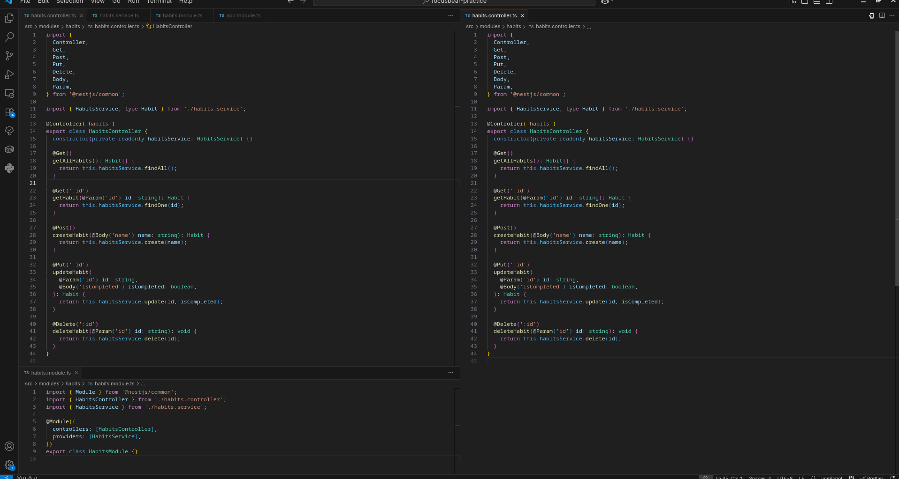
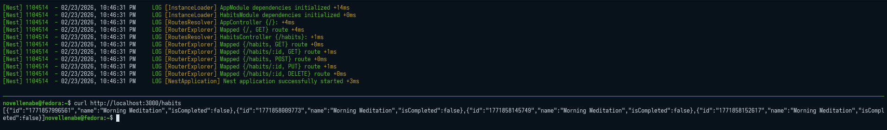
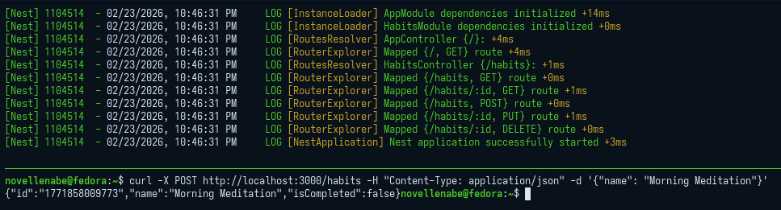

# nestjs-rest-api.md

## 7.1 Creating REST APIs with NestJS

### 1. What is the role of a controller in NestJS?

A controller's primary role is to act as the HTTP presentation layer. It acts as the "traffic cop" for the application:
* It receives incoming HTTP requests from the client.
* It routes those specific requests (like `GET /habits`) to the correct handler functions.
* It parses incoming data (like the request body or parameters) and formats the outgoing response.
* **Crucially:** It should *not* contain complex business logic. 

### 2. How should business logic be separated from the controller?

Business logic should be entirely encapsulated within **Services** (also known as Providers). 
* **The Controller:** Handles the "what" (parsing requests, sending responses).
* **The Service:** Handles the "how" (database operations, data formatting, complex calculations).

The controller connects to the service through **Dependency Injection**. By declaring the service in the controller's constructor, NestJS automatically instantiates and provides the service so the controller can delegate tasks to it.

### 3. Why is it important to use services instead of handling logic inside controllers?

1.  **Single Responsibility Principle (SRP):** Controllers deal with HTTP routing; Services deal with data and business rules. Keeping them separate makes the codebase much easier to read, navigate, and maintain.
2.  **Reusability:** A single service method (e.g., `updateHabitStreak()`) can be shared and used by multiple controllers, WebSockets, or background CRON jobs without duplicating the underlying code.
3.  **Testability:** It is significantly easier to write unit tests for a standalone service class than it is to mock HTTP request and response objects to test logic buried inside a controller.

### 4. How does NestJS automatically map request methods (GET, POST, etc.) to handlers?

NestJS maps request methods using **Decorators** (e.g., `@Get()`, `@Post()`, `@Put()`, `@Delete()`). 

Under the hood, NestJS uses reflection (via the `reflect-metadata` package) to read these decorators when the application starts up. It extracts this metadata and automatically registers the routes with the underlying HTTP framework (Express.js by default). This ensures that incoming network traffic matching a specific path and HTTP method is routed exactly to the class method you decorated.

### Code

### GET Method

### POST Method

### PUT Method

### DELETE Method

