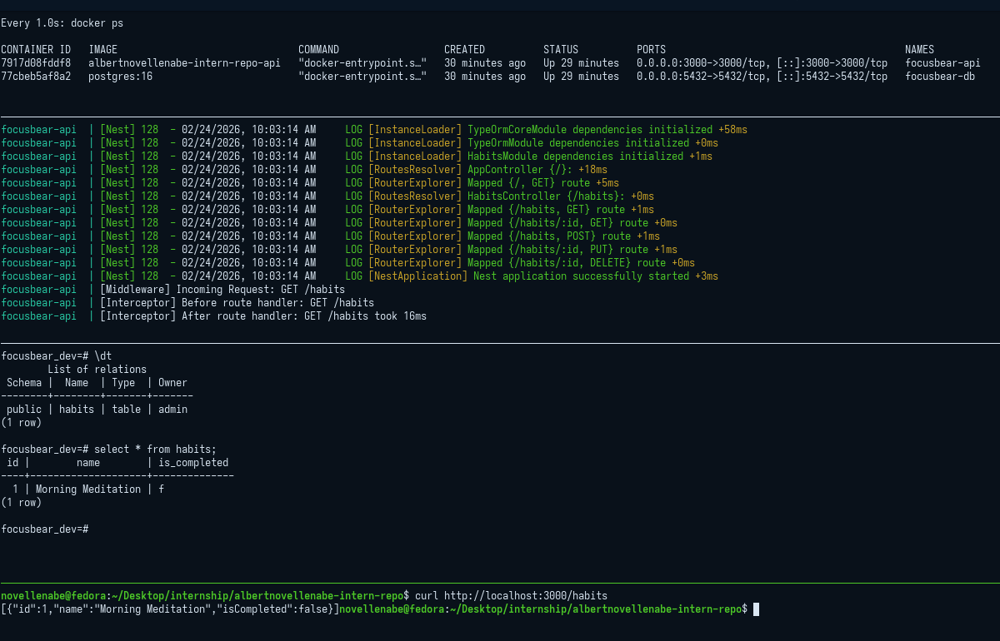

# nestjs-typeorm.md

## 7.4 Connecting to PostgreSQL with TypeORM in NestJS

### How does `@nestjs/typeorm` simplify database interactions?

The `@nestjs/typeorm` package acts as the bridge between NestJS's dependency injection system and the TypeORM library. 
* **Automatic Lifecycle Management:** It automatically establishes the database connection when the application boots and closes it gracefully when the server shuts down.
* **Seamless Injection:** It allows you to inject database repositories directly into your services using the `@InjectRepository()` decorator, completely removing the need to manually instantiate database connections in every file.

### What is the difference between an entity and a repository in TypeORM?

* **Entity:** An entity is a structural blueprint. It is a TypeScript class decorated with `@Entity()` that maps exactly to a PostgreSQL table. The class properties (like `id`, `name`, `email`) map to the columns in that table.
* **Repository:** A repository is the active worker. It is an object provided by TypeORM that contains all the built-in methods (like `.find()`, `.save()`, `.update()`, and `.delete()`) needed to interact with the data for a specific entity. 

### How does TypeORM handle migrations in a NestJS project?

While TypeORM has a `synchronize: true` option that automatically updates the database schema to match your entities during development, this is highly dangerous in production. 
Instead, TypeORM uses **migrations**. A migration is a timestamped file containing precise SQL instructions on how to alter the database schema (e.g., adding a new column) and how to revert that change. You use the TypeORM CLI to generate and run these migrations, ensuring the database evolves safely alongside your application code.

### What are the advantages of using PostgreSQL over other databases in a NestJS app?

PostgreSQL is an enterprise-grade, highly extensible relational database that pairs perfectly with NestJS and TypeORM.
* **Advanced Data Types:** It supports powerful column types like `JSONB` for storing semi-structured data, and arrays, which are heavily supported by TypeORM decorators.
* **Geospatial Capabilities:** Through extensions like PostGIS, it can handle complex location data and routing natively (which is incredibly useful for map-based or tracking applications).
* **Reliability:** It offers strict ACID compliance, ensuring data integrity for critical systems like user billing or focus tracking.

### Successfully Connected Postgres to NestJS using Docker

