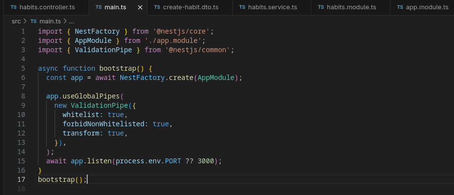
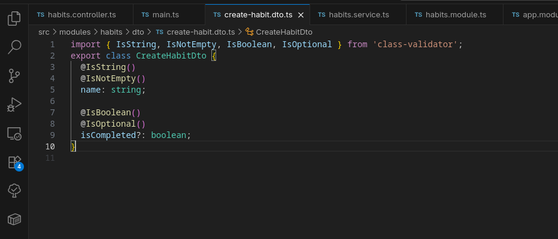
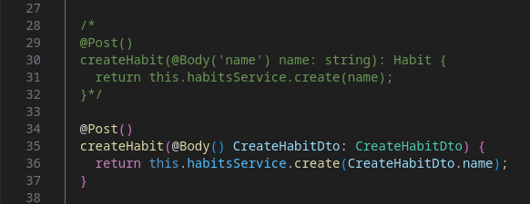

# nestjs-validation.md

## 7.2 Validating Requests with Pipes in NestJS

### What is the purpose of pipes in NestJS?

Pipes serve two primary purposes in the NestJS request lifecycle:
1.  **Validation:** Evaluating input payload. If the data is valid, it proceeds; if not, the pipe automatically throws a structured `BadRequestException` before the controller even executes.
2.  **Transformation:** Converting input data to the desired format (e.g., parsing a string ID from a URL parameter into a JavaScript integer).

Instead of writing manual validation middleware, pipes intercept the request just before the route handler, acting as a strict firewall for your core logic.

### How does `ValidationPipe` improve API security and data integrity?

The `ValidationPipe` acts as a global gatekeeper. It improves security and integrity by:
* **Preventing Bad Data:** It guarantees that the data entering your services perfectly matches your database requirements, preventing unexpected crashes or SQL errors.
* **Stripping Malicious Payloads:** When configured with `whitelist: true`, the `ValidationPipe` automatically removes any extra fields sent by a user that are not explicitly defined in your DTO. This prevents "mass assignment" vulnerabilities where a malicious user might try to inject an `isAdmin: true` flag into a standard profile update payload.

### What is the difference between built-in and custom pipes?

* **Built-in Pipes:** NestJS provides several out-of-the-box pipes for common use cases, such as `ValidationPipe` (for DTOs), `ParseIntPipe` (for converting strings to numbers), and `ParseUUIDPipe` (for validating UUIDs).
* **Custom Pipes:** You create these by implementing the `PipeTransform` interface. They are used for highly specific, domain-level logic that built-in pipes can't handle. For example, you might write a custom pipe to verify that an uploaded string matches a specific, proprietary format used internally by Focus Bear.

### How do decorators like `@IsString()` and `@IsNumber()` work with DTOs?

These decorators come from the `class-validator` package and utilize TypeScript's metadata reflection.
* By adding `@IsString()` or `@IsNumber()` to a property inside a Data Transfer Object (DTO) class, you attach invisible metadata rules to that property.
* When a request arrives, the `ValidationPipe` instantiates the DTO, reads this metadata, and checks the incoming JSON payload against the rules. If the payload violates a rule, the pipe immediately blocks the request and returns a 400 status code with an array of specific error messages.

### Main Code

### Create Habit Dto

### Updated Controller

