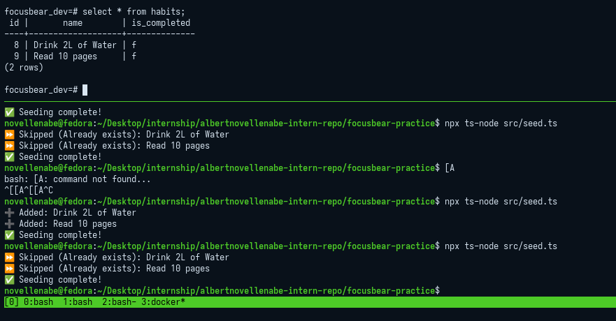
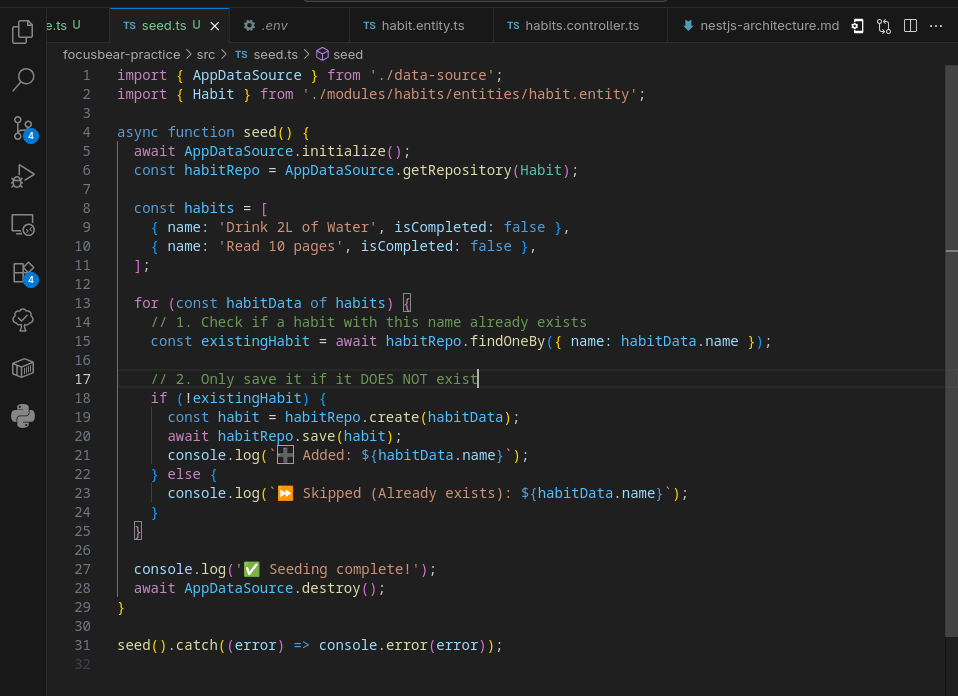

# typeorm-migrations.md

## 7.5 Seeding & Migrations in TypeORM

### What is the purpose of database migrations in TypeORM?

Database migrations act as version control for your database schema. Instead of making manual SQL changes to your database (like `CREATE TABLE` or `ALTER TABLE`), migrations encapsulate these changes in timestamped files. This ensures that every developer on the team, as well as the production, staging, and testing environments, all have the exact same database structure.

### How do migrations differ from seeding?

* **Migrations:** Focus on the *structure* (schema) of the database. They create tables, add columns, modify data types, and set up foreign key constraints. 
* **Seeding:** Focuses on the *content* (data) of the database. Seeding scripts insert default, initial, or dummy data into the tables that the migrations created (e.g., populating a "roles" table with 'Admin' and 'User', or generating fake users for a development environment).

### Why is it important to version-control database schema changes?

Version-controlling schema changes guarantees reproducibility and safety. If a new developer joins the Focus Bear team, they can run a single command to build the entire database from scratch, matching production exactly. Furthermore, if a new feature requires a database change, that change is reviewed in a Pull Request right alongside the code that relies on it, preventing mismatches between the API logic and the database structure.

### How can you roll back a migration if an issue occurs?

TypeORM migrations contain both an `up()` method (to apply changes) and a `down()` method (to reverse them). If an issue occurs, you can use the TypeORM CLI command `migration:revert`. This command looks at the internal `migrations` tracking table in your database, finds the most recently applied migration, and executes its `down()` method, effectively undoing the last database change safely.

### Output Skipping Duplicates

### Sample Test Code

