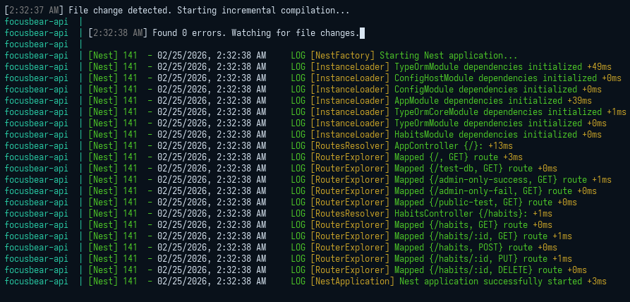
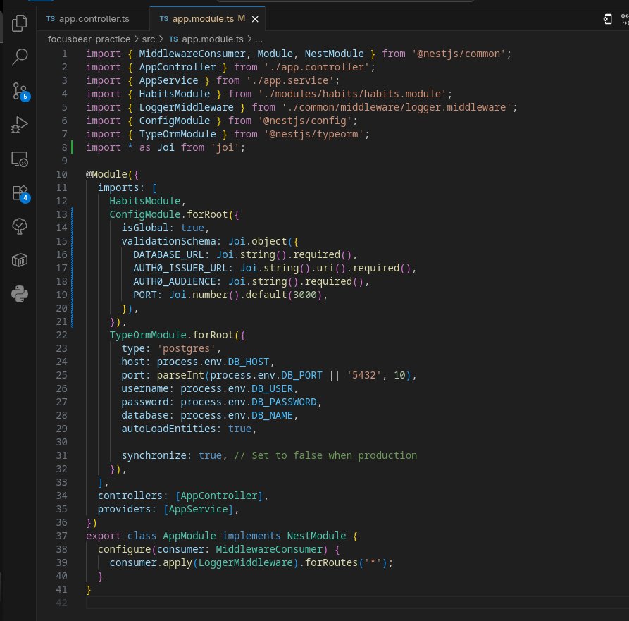

# nestjs-env-config.md

## 8.2 Handling Environment Variables & Configuration in NestJS

### How does `@nestjs/config` help manage environment variables?
The `@nestjs/config` package centralizes configuration management in a NestJS application. 
* It automatically loads variables from a `.env` file into Node's `process.env`.
* It provides a globally injectable `ConfigService`. Instead of scattering `process.env.DB_PASSWORD` throughout the codebase, you inject the `ConfigService` into your classes, which provides a safer, testable, and more structured way to retrieve values.

### Why should secrets (e.g., API keys, database passwords) never be stored in source code?
Storing secrets in source code is a massive security vulnerability.
* **Permanent History:** Once a secret is committed to Git, it lives in the repository's history forever, even if deleted in a later commit.
* **Exposure Risk:** Anyone with read access to the repository (or if the repo accidentally becomes public) instantly gains access to your databases, Auth0 tenants, or paid API services.
* Secrets should only exist in local `.env` files (which are strictly ignored via `.gitignore`) or securely injected via your hosting provider's dashboard in production.

### How can you validate environment variables before the app starts?
You can pass a validation schema (often using a library like `Joi` or `class-validator`) directly into the `ConfigModule.forRoot()` setup. 
This enforces the **"Fail Fast"** principle. When the NestJS application boots, it checks the `.env` file against the schema. If a required variable like `DATABASE_URL` is missing, or if `PORT` is a string instead of a number, the application intentionally crashes immediately with a clear error message, rather than failing unpredictably later in production.

### How can you separate configuration for different environments (e.g., local vs. production)?
* **Locally:** You can create multiple files like `.env.development` and `.env.test`. You configure the `ConfigModule` to read a specific file based on the current `NODE_ENV` environment variable.
* **Production:** In staging or production environments (like AWS, Render, or Heroku), you generally do not use `.env` files at all. Instead, you define the environment variables directly within the platform's configuration dashboard. The `ConfigModule` is smart enough to prioritize these system-level variables over local files.

### Secure Log Output

### Code Setup With JOI

