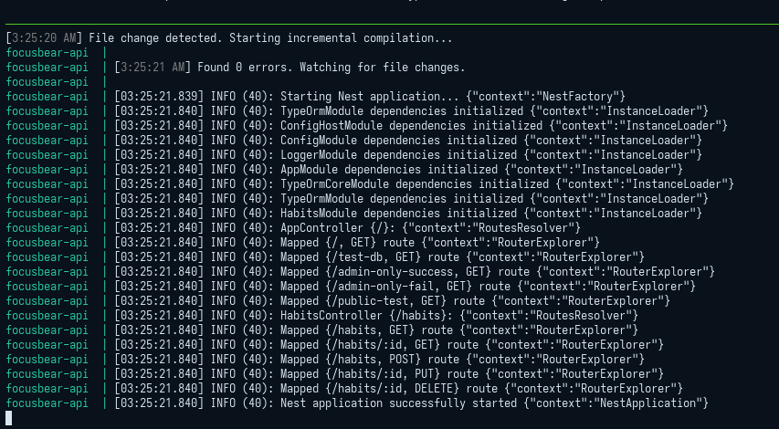

# nestjs-logging.md

## 8.3 Logging & Error Handling in NestJS

### What are the benefits of using `nestjs-pino` for logging?

* **Extreme Performance:** Pino is known as one of the fastest Node.js loggers because it minimizes overhead.
* **Structured Logging (JSON):** Instead of outputting plain text strings, Pino natively logs everything as structured JSON objects. This makes it incredibly easy for log aggregation tools (like Datadog, AWS CloudWatch, or Kibana) to parse, search, and set up alerts based on specific log properties.
* **Automatic Context:** `nestjs-pino` automatically attaches the HTTP request context (like request IDs, methods, and URLs) to every log generated during that request, making it easy to trace exactly what a user was doing when an issue occurred.

### How does global exception handling improve API consistency?

A global exception filter ensures that no matter where an error occurs in your application (a database failure, a validation error, or a missing route), the frontend receives the exact same predictable JSON structure. 
Instead of the client randomly receiving a raw HTML error page or an unstructured string, it will always get a standardized format like:
`{ "statusCode": 400, "timestamp": "2026-02-25T...", "path": "/habits", "message": "Invalid input" }`.
This consistency prevents frontend crashes and stops sensitive stack traces from leaking to the public in production.

### What is the difference between a logging interceptor and an exception filter?

* **Interceptor:** Sits in the normal execution flow. It intercepts incoming requests and outgoing successful responses. It is perfect for logging how long a request took to execute or modifying data right before it is sent to the client.
* **Exception Filter:** Exists outside the "happy path." It only triggers when an exception (error) is explicitly thrown or accidentally caused by the application. Its sole job is to catch that error, log it, and format the final HTTP response sent to the user.

### How can logs be structured to provide useful debugging information?

To be useful, logs should act as a detailed audit trail. A well-structured log should include:
1. **Traceability:** A unique Request ID so you can filter logs to show only the events of a specific user's interaction.
2. **Context:** The User ID (if authenticated), HTTP method (`GET`, `POST`), and the specific route (`/users/profile`).
3. **Origin:** The specific NestJS Class or Service name where the log was triggered.
4. **Severity Levels:** Using `info` for standard events, `warn` for unexpected but handled issues, and `error` or `fatal` for actual crashes requiring immediate attention.

### Cleaner Log Output

