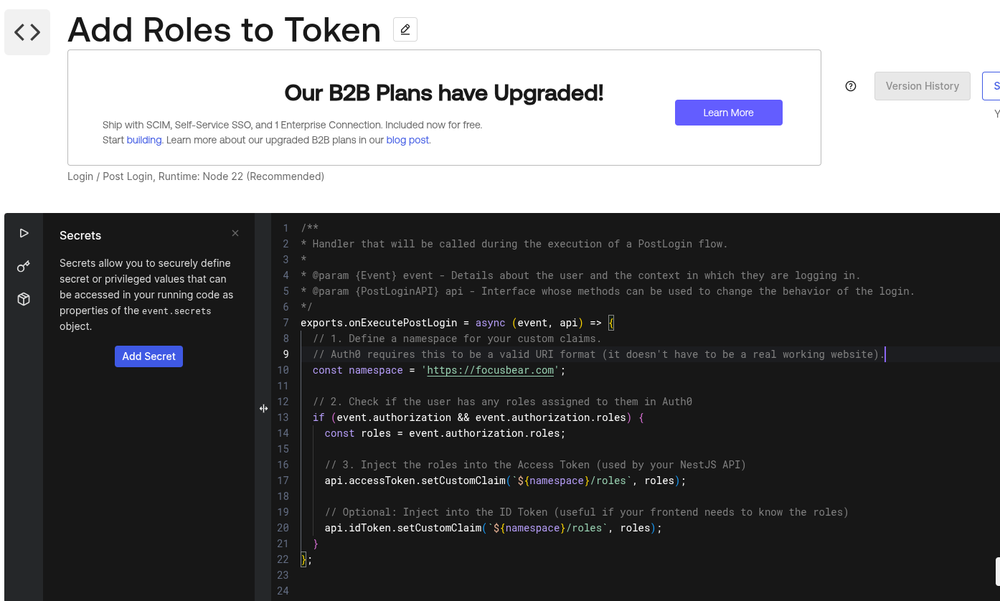
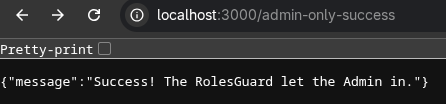
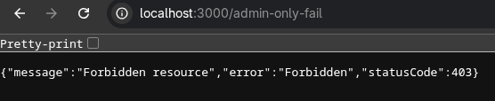
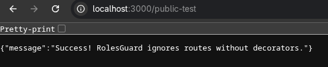

# nestjs-rbac.md

## 8.1 Role-Based Authorization (RBAC) in NestJS

### How does Auth0 store and manage user roles?

Auth0 centralizes role management within its own dashboard, completely detaching this responsibility from your database. 
* **Creation & Assignment:** You create Roles (e.g., `Admin`, `Standard User`), define specific Permissions/Scopes (e.g., `delete:users`, `read:habits`), attach those permissions to the roles, and then assign the roles to specific users.
* **Token Injection:** By default, Auth0 does not include a user's roles in the JWT Access Token. To make roles available to the NestJS backend, you must use an **Auth0 Action** (a custom Node.js script that runs post-login) to inject the user's roles into the token as a "custom namespaced claim" (e.g., `https://focusbear.com/roles: ["admin"]`). You can also toggle "Add Permissions in the Access Token" in the Auth0 API settings to pass raw permissions directly.

### What is the purpose of a guard in NestJS?

A Guard is a specialized NestJS class that determines whether a request should be allowed to proceed to a route handler based on specific runtime conditions (like checking a user's role). 
Unlike standard Express middleware, Guards have access to the `ExecutionContext`. This means a Guard knows exactly which controller and method are about to be executed, allowing it to read custom metadata attached to that specific route before making an authorization decision.

### How would you restrict access to an API endpoint based on user roles?

Restricting access requires a three-step process:
1.  **Create a Custom Decorator:** You create a `@Roles()` decorator that uses NestJS's `SetMetadata` function to tag specific endpoints with the required roles (e.g., `@Roles('admin')`).
2.  **Create a Roles Guard:** You build a class implementing the `CanActivate` interface. This Guard uses the `Reflector` utility to read the required roles from the route's metadata.
3.  **Evaluate the Token:** The Guard extracts the decoded Auth0 JWT payload from the request object (usually placed there by an Authentication Guard running just before it). It checks if the user's injected roles/claims match the roles required by the decorator. If they match, it returns `true`. If not, it automatically throws a `403 Forbidden` exception.

### What are the security risks of improper authorization, and how can they be mitigated?

* **Risks:** The primary risk is **Privilege Escalation**, where a standard user figures out how to access admin-level endpoints (like deleting other users or modifying global settings). Another risk is **IDOR (Insecure Direct Object Reference)**, where a user alters an ID in a request payload to access data belonging to someone else.
* **Mitigation:** * Adopt a **"Default Deny"** posture by applying your Authentication Guard globally so every endpoint is locked down by default.
    * Rely entirely on the cryptographically signed JWT payload from Auth0 to determine a user's role, *never* trusting role data sent directly in the HTTP body by the client.
    * Write thorough E2E (End-to-End) tests that specifically attempt to access protected routes using tokens with insufficient privileges.
    
### Auth0 Setup

### Auth0 Sample: admin-only-success

### Auth0 Sample: admin-only-fail

### Auth0 Sample: public-test

