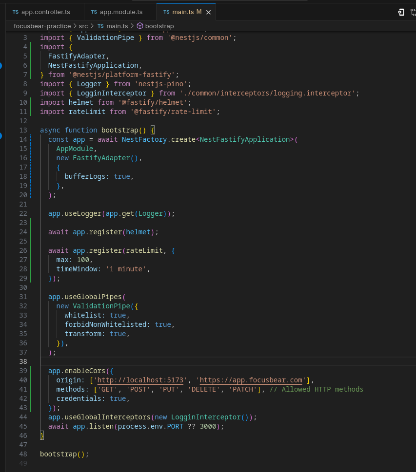

# nestjs-security.md

## 8.4 Security Best Practices in NestJS

### What are the most common security vulnerabilities in a NestJS backend?

1. **Injection Attacks (SQL/NoSQL):** Attackers insert malicious database commands into user inputs. (Mitigated in NestJS by using TypeORM, which automatically parameterizes queries).
2. **Cross-Site Scripting (XSS):** Attackers inject malicious client-side scripts into web pages viewed by other users. (Mitigated by input validation and output encoding).
3. **CORS Misconfigurations:** Overly permissive Cross-Origin Resource Sharing (CORS) allows malicious websites to make unauthorized requests to your API on behalf of an authenticated user.
4. **Insecure Direct Object Reference (IDOR):** Failing to check if a user actually owns the resource they are requesting (e.g., User A requesting `/habits/5` which belongs to User B).
5. **Brute Force / Credential Stuffing:** Automated scripts guessing passwords or utilizing leaked credentials from other sites.

### How does `@fastify/helmet` improve application security?

Helmet is a collection of middleware functions that automatically set secure HTTP response headers. 
It protects the app from well-known web vulnerabilities by:
* **Hiding the `X-Powered-By` header:** This prevents attackers from easily knowing you are using Express/Fastify, forcing them to guess your tech stack.
* **Setting Content Security Policy (CSP):** Helps prevent XSS attacks by dictating exactly where scripts and resources are allowed to load from.
* **Enforcing Strict-Transport-Security (HSTS):** Forces browsers to only interact with your API over secure HTTPS connections.
* **Preventing Clickjacking:** Sets the `X-Frame-Options` header to stop malicious sites from embedding your application inside an invisible iframe.

### Why is rate limiting important for preventing abuse?

Rate limiting restricts the number of requests a single IP address or user can make to your API within a specific time window. 
* **Prevents DoS/DDoS Attacks:** It stops malicious actors from overwhelming your server with millions of requests, which would crash the app for legitimate users.
* **Stops Brute Forcing:** It limits how many times someone can attempt to guess a password on your login route.
* **Cost Control:** If you are using paid third-party APIs (like Auth0 or an email provider), rate limiting prevents attackers from intentionally driving up your cloud computing bills.

### How can sensitive configuration values be protected in a production environment?

* **Never Commit Secrets:** `.env` files must strictly remain in `.gitignore`. 
* **Environment Injection:** In production (like Render, AWS, or Heroku), secrets are entered directly into the hosting provider's secure dashboard, which injects them directly into the runtime environment.
* **Secret Managers:** For enterprise applications, credentials should be stored in dedicated vaults (like AWS Secrets Manager or HashiCorp Vault) that securely rotate passwords and provide them to the application at startup.
* **Strict Validation:** Using tools like `Joi` (which we implemented) ensures that if a secret fails to load into the environment, the application refuses to boot, preventing it from running in an insecure state.

### Security Code Ouput [for i in {1..105}; do curl -s -o /dev/null -w "Request $i: HTTP %{http_code}\n" http://localhost:3000/test-db; done]

### Security Code Structure

