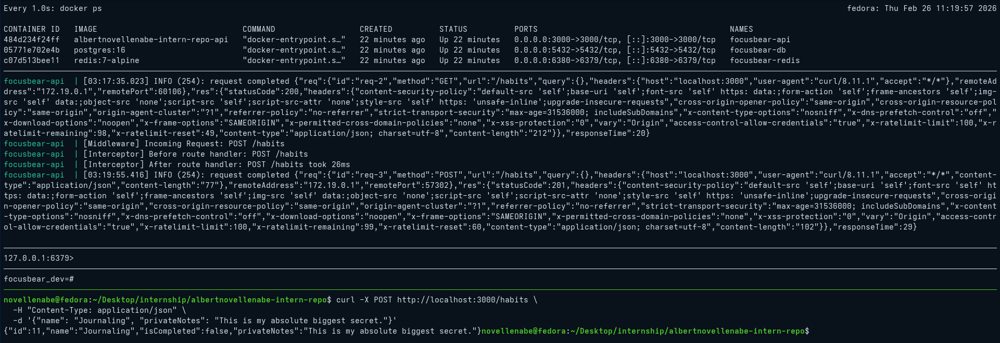
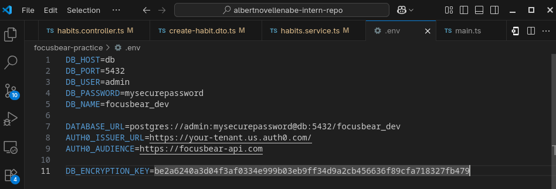
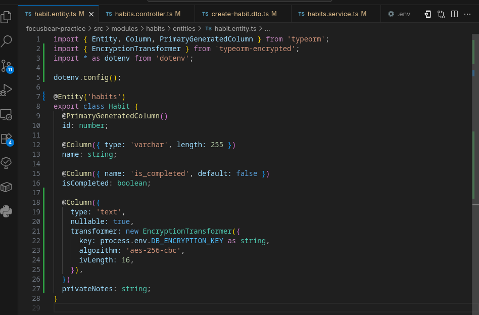

# typeorm-encrypted.md

## 8.5 Using typeorm-encrypted for Data Encryption

### Why does Focus Bear double encrypt sensitive data instead of relying on database encryption alone?

Database encryption "at rest" (like AWS RDS or EBS encryption) only protects the data if the physical hard drives are stolen from the data center. 
If a hacker successfully executes a SQL injection attack, or if a rogue database administrator logs directly into the PostgreSQL instance, the database will automatically decrypt the data and show it to them in plain text. 
By "double encrypting" at the application level, Focus Bear ensures that the database only ever stores scrambled ciphertext. Even with full database access, an attacker cannot read the sensitive fields because the decryption key lives exclusively inside the NestJS server.

### How does `typeorm-encrypted` integrate with TypeORM entities?

It integrates seamlessly using TypeORM's built-in **Value Transformers**. 
When you define a column in your entity, you pass the encryption configuration into the `@Column({ transformer: ... })` options. 
* **On Save:** Before TypeORM sends the `INSERT` or `UPDATE` query to PostgreSQL, the transformer intercepts the plain text string and encrypts it.
* **On Load:** When TypeORM fetches the row via a `SELECT` query, the transformer intercepts the ciphertext and decrypts it back into a readable string before handing it to your NestJS service.

### What are the best practices for securely managing encryption keys?

1. **Never Hardcode:** Keys must never exist in the source code or be committed to version control.
2. **Environment Injection:** Locally, keys should live in a `.env` file and be strictly validated on boot (e.g., using the `Joi` validation we set up earlier).
3. **Secret Vaults:** In production, keys should be injected at runtime using secure key management services like AWS Secrets Manager, Google Cloud Secret Manager, or HashiCorp Vault.
4. **Key Rotation:** The system should support rotating keys periodically in case a key is suspected of being compromised.

### What are the trade-offs between encrypting at the database level vs. the application level?

**Database-Level (At-Rest):**
* **Pros:** Zero code changes required. It is completely transparent to the application, meaning you can still easily use SQL `WHERE`, `ORDER BY`, and `LIKE` queries on the data.
* **Cons:** Does not protect against application vulnerabilities (like SQL injection) or compromised database credentials.

**Application-Level (Field-Level via `typeorm-encrypted`):**
* **Pros:** Maximum security. The database engine itself never sees the plain text data.
* **Cons:** Performance overhead from encrypting/decrypting on the Node.js server. **Crucially, you lose the ability to easily search or sort the data in the database.** You cannot write a query like `SELECT * FROM users WHERE email = 'test@test.com'` if the email column is encrypted with a randomized initialization vector (IV), because the ciphertext changes every time it is encrypted.

### typeorm-encrypted Sample Output 1

### typeorm-encrypted Sample Output 2

### Config Variable

**node -e "console.log(require('crypto').randomBytes(32).toString('hex'))"**

### Config Code Usage

