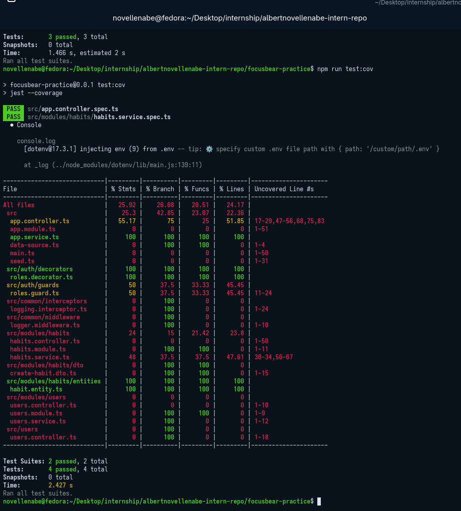
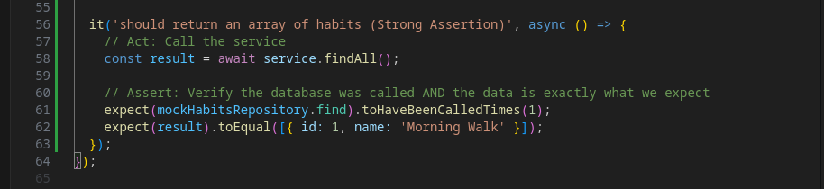

# nestjs-test-coverage.md

## 9.10 Understanding the Focus Bear Coverage Bar & Writing Meaningful Tests

### What does the coverage bar track, and why is it important?

The coverage bar (generated by Jest using `npm run test:cov`) tracks exactly which parts of the codebase were executed during a test run. It measures four specific metrics:
1. **Statements:** Was every individual instruction executed?
2. **Branches:** Was every logical path taken? (e.g., testing both the `if` and the `else` blocks).
3. **Functions:** Was every function called at least once?
4. **Lines:** Was every executable line of code reached?
It is important because it provides a quantitative, visual map of the application's untested blind spots, highlighting code that could harbor hidden bugs.

### Why does Focus Bear enforce a minimum test coverage threshold?

Enforcing an 80% minimum threshold acts as an automated quality gate. It prevents developers from merging massive new features without writing the corresponding safety nets. It ensures a baseline level of stability across the team, reducing the chances of regressions and making future refactoring much safer.

### How can high test coverage still lead to untested functionality?

High coverage only proves that a line of code was *executed*; it does not prove that the code actually did what it was supposed to do. This is the danger of "vanity metrics." If a developer writes a test that calls a complex calculation function, the coverage report will show 100% for that file. However, if the developer forgets to write an `expect()` statement to verify that the final calculation is actually correct, the test is useless. The code runs, but the behavior is completely unverified.

### What are examples of weak vs. strong test assertions?

* **Weak Assertion (The Vanity Test):** `expect(result).toBeDefined();

### Jest Sample Test Output

### Jest Sample Test Code

