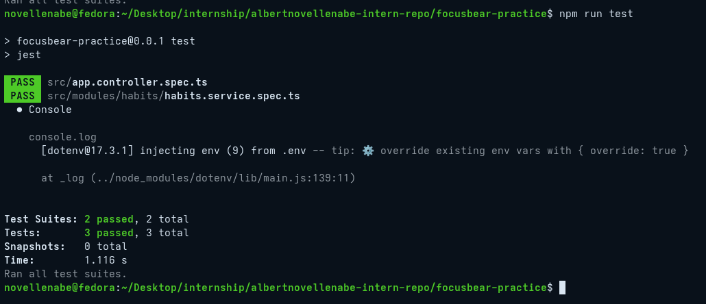

# nestjs-testing-intro.md

## 9.5 Introduction to Testing in NestJS

### What are the key differences between unit, integration, and E2E tests?

* **Unit Tests:** Focus on testing a single class, method, or function in absolute isolation. In NestJS, this usually means testing a single Service while completely faking (mocking) the database, caches, or external APIs. They execute in milliseconds.
* **Integration Tests:** Verify that multiple internal components work together correctly. For example, an integration test might check if a service can successfully write to a local, isolated PostgreSQL database instance via TypeORM without spinning up the entire HTTP server.
* **End-to-End (E2E) Tests:** Test the application exactly as a client would interact with it. An E2E test sends a real HTTP request to the Fastify instance, routes through the controller, hits the service, interacts with the database, and evaluates the final HTTP response. These are the slowest but provide the highest confidence.

### Why is testing important for a NestJS backend?

The backend acts as the central source of truth for the entire Focus Bear platform. If a critical bug is introduced here, it impacts all users simultaneously. Automated testing ensures that complex business logic—such as double-encrypting sensitive habit notes, processing queue jobs, or handling Auth0 access controls—works flawlessly across updates. It grants developers the confidence to refactor backend architecture without the fear of silently corrupting data or taking down production endpoints.

### How does NestJS use `@nestjs/testing` to simplify testing?

NestJS provides a standalone testing module that mimics the framework's actual runtime environment. By using the `Test.createTestingModule()` utility, developers can compile an isolated module specifically for testing. This makes Dependency Injection (DI) incredibly easy to manage; developers can effortlessly swap out real providers (like a live TypeORM database connection) with custom mock objects using the `.overrideProvider()` syntax.

### What are the challenges of writing tests for a NestJS application?

* **Dependency Resolution Errors:** The most notorious challenge is the "Nest can't resolve dependencies" error. If a service injects a TypeORM repository, a Redis client, and a custom logger, every single one of those dependencies must be explicitly provided or mocked in the testing module, or the test will crash on boot.
* **Mocking Complex Libraries:** Creating accurate mocks for complex tools like TypeORM's `QueryBuilder` or external APIs can be tedious.
* **Database State Management:** Running Integration or E2E tests requires strict management of the test database. The database must be seeded with test data before the suite runs and completely wiped clean afterward to prevent test pollution.

### Jest Sample Test Output

