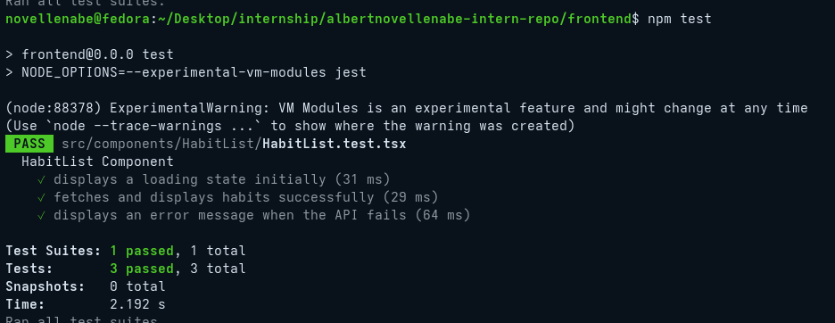
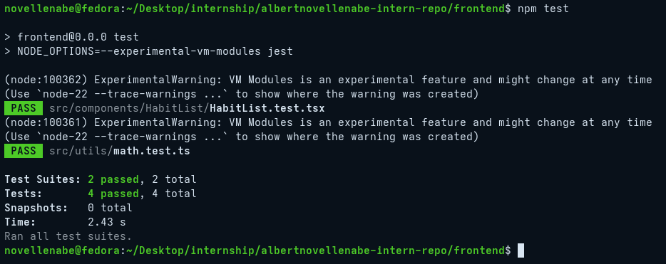
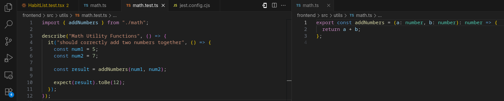

# unit_test.md

## 9.2 Mocking API Calls in Jest

### Why is it important to mock API calls in tests?

1. **Speed & Reliability:** Real network requests are slow and susceptible to timeouts. If the backend is down, the frontend tests will fail (creating a "flaky" test suite). Mocking makes tests execute instantly and reliably.
2. **Isolation:** A unit test should only test the component itself. If a test fails because the API returned a 500 error, you aren't testing the component; you are testing the backend. 
3. **Data Safety:** Running tests against a real API can accidentally mutate the database (e.g., creating hundreds of fake test users or deleting real habits).
4. **Testing Edge Cases:** Mocking allows you to easily simulate rare scenarios that are hard to trigger in real life, such as forcing a specific API error code or a 10-second network delay to verify loading spinners.

### What are some common pitfalls when testing asynchronous code?

* **Forgetting to wait:** The most common mistake is firing an event (like clicking a button) and immediately checking the DOM before the mocked API promise resolves. You must use asynchronous queries like `await screen.findByText()` to give React time to re-render.
* **False Positives:** If you forget to return a Promise in your test or fail to `await` an assertion, the test might finish executing and pass *before* the asynchronous code actually runs and throws an error.
* **Not cleaning up mocks:** If you mock a global function like `fetch` in one test and forget to clear it, that mock will "leak" into the next test, causing confusing failures. Always use `jest.restoreAllMocks()` or `mockClear()`.

### Jest Sample Test Output

### Jest Sample Test Code

## 9.4 Introduction to Unit Testing with Jest

### Why is automated testing important in software development?

1. **Prevents Regressions:** As Focus Bear grows, modifying one feature can accidentally break another. Automated tests act as a safety net, instantly alerting developers if their new code breaks existing functionality.
2. **Refactoring Confidence:** Developers can rewrite and optimize messy code without fear. If the tests still pass, the optimization is safe.
3. **Living Documentation:** Tests explicitly show how a component or function is *supposed* to be used, acting as up-to-date documentation for new engineers joining the team.
4. **Forces Better Architecture:** Code that is difficult to test is usually poorly written (e.g., too tightly coupled). Writing tests forces developers to build modular, single-purpose functions.

### What did you find challenging when writing your first Jest test?

The actual testing logic (`expect(result).toBe(12)`) is straightforward, but setting up the testing environment itself was highly challenging. 
Because the project uses Vite, which relies entirely on modern ES Modules (`import/export`), integrating it with Jest (which historically defaults to CommonJS and `require`) caused massive configuration conflicts. I had to explicitly configure Node.js to use `--experimental-vm-modules` and manually override `ts-jest` to use `ESNext` modules just to get the tests to run. Furthermore, mocking browser APIs like `fetch` required manually injecting dummy functions into `globalThis`, as Jest's internal `jsdom` environment does not natively support them.

### Jest Sample Test Output

### Jest Sample Test Code

